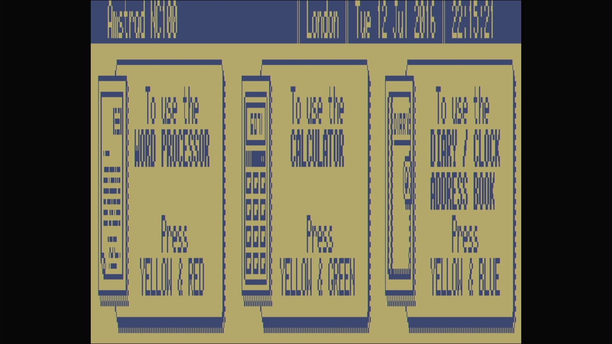

# pi-mame 👾

[](https://github.com/Xalior/pi-mame/actions/workflows/build.yml)

Bare-metal MAME for the Raspberry Pi 4. No Linux, no OS, no desktop — the
Pi boots in seconds straight into an emulated machine, like an appliance,
because that's what it is. 📺⚡

pi-mame embeds MAME's emulation core on the [Circle](https://github.com/rsta2/circle)
bare-metal framework through a purpose-built
[SDL2 shim](https://github.com/Xalior/circle-libsdl2). Every image is the
same emulator; what differs is what happens at power-on, and that is
decided when the image is **built** — never by config files or a command
line, because there are none. A machine image powers on as its one
machine, instantly, every time. A platform card powers on into a picker
instead: a menu of that platform's machines — pick one with the keyboard
and, if its ROMs are on the card, it starts. Nothing you pick is
remembered — power off, and the next power-on asks again. 🔁

## 📥 Download a ready-made image

Every tagged release carries several asset forms — grab yours from
[**the latest release**](https://github.com/Xalior/pi-mame/releases/latest)
and skip the toolchain:

- **`pi-mame-<tag>-<platform>-<free|public>.zip`** — a platform card, the
  ready-to-boot download: Pi firmware, `config.txt`, the platform's regional
  `cmdline.txt`, the boot picker, that platform's binary (as
  `pi-mame-core-rpi4.img`), a menu of the platform's machines, and their
  ROMs. The **free** card lists only machines whose ROMs are all free-tier
  and bundles just those free-blessed ROMs. The **public** card lists the
  full roster and bundles the full ROM set — the grey "public-tier" ROMs are
  not in this repo; CI fetches them from their mirrors at build time into this
  zip alone (see [Assets you must supply](#-assets-you-must-supply) for the
  tiers). Extract it onto a blank **FAT32** SD
  card — files at the card's top level, not in a subfolder — put the card in
  the Pi, plug the display into **HDMI0** (the micro-HDMI port next to the
  USB-C power connector), and power on.
- **`kernel8-<machine>.img`** — one machine's kernel, for every machine in
  the roster. Drop it onto a card you prepared from a platform card, as
  `pi-mame-core-rpi4.img` (the name `config.txt` boots), replacing the one
  already there — that is how you point a card at a specific machine.

Which machine? [docs/sinclair/](docs/sinclair/README.md),
[docs/amstrad/](docs/amstrad/README.md) and
[docs/commodore/](docs/commodore/README.md) list every one, with a details
page each.

CI **compiles** every release on a clean Ubuntu runner — that's what's
proven for every asset there. It does not boot-test them: hardware proof
lives in the platform tables, where every screenshot is an HDMI capture
from a real Pi 4 (more in
[Continuous integration](#-continuous-integration) below). A bare
`kernel8-<machine>.img` carries no ROMs — add the machine's ROMs to the
card's `roms/` (and `carts/` for the CPC+ range) yourself; see
[Assets you must supply](#-assets-you-must-supply).

Prefer building it yourself? See
[Building from source](#-building-from-source-the-long-way) below.

## 🔬 How small is the P in this PoC?

Delightfully small. Let's be precise about what this actually is:

- **Three platforms are proven** — Sinclair, Amstrad, and Commodore. Each is
  a family of machines built on related hardware, sharing a MAME driver
  lineage and, often, ROMs: see [docs/sinclair/](docs/sinclair/README.md),
  [docs/amstrad/](docs/amstrad/README.md) and
  [docs/commodore/](docs/commodore/README.md) for exactly which machines and
  what each needs — every one with an HDMI capture from a real Pi 4 on its
  details page.
- **One board.** 🥧 Proven on a Raspberry Pi 4 Model B (4GB). Nothing else
  has ever booted it. (The firmware files for the Pi 400 and CM4 ride
  along because Circle ships them — consider those a rumor, not a
  feature.)
- **Single-threaded, and silent.** One of the Pi's four cores does all the
  work, and audio isn't wired up yet. 🔇

Building more of MAME in is a `SOURCES` change in `host/machines.mk`
(each platform's driver list); running more is a matter of what you put in
`roms/`. Everything on this page describes **this repository's build system
and its defaults** — all of it is yours to change: add a machine's row to
`host/machines.mk` (its defaults string and assets), write your own canvas,
go wild. A custom image is the same build with your choices in it. 🧪

## 📦 The default images

There is **one binary per platform** — one per vendor-class (Sinclair,
Amstrad, Commodore), each linked from that platform's own isolated MAME build (its own
drivers, no crossover). No machine is compiled in: the machine name and its
media ride a fixed-size **defaults string** at offset `0x800` in the image,
written before boot. "Which machine" is not configuration you edit at
runtime — there is no CLI and no config files of ours — it's what got
stamped into that block. 💾

Three shapes come out of that one binary per platform:

| Image | Powers on into |
|---|---|
| `kernel8-<machine>.img` | one machine — the platform binary with that machine's defaults stamped in (`make kernel MACHINE=<name>`) |
| `kernel8-<platform>.img` | the platform's **no-options** kernel — unpatched, so MAME boots its own system list; machines with ROMs on the card run |
| `kernel8-rpi4.img` (the **boot picker**, `make picker`) | a menu of the platform's machines read from `bootmenu.cfg`; a pick patches the platform binary and chain-boots it |

Those `kernel8-*.img` names are the build products (and the bare release
downloads). On a card the firmware and picker boot two fixed names instead:
the core — a machine image or a platform binary — is copied on as
`pi-mame-core-rpi4.img`, and the picker as `pi-mame-boot-rpi4.img`. The
copy-to-card bundles and `make sd` / `make card` put them there for you; do
the same rename by hand only if you're dropping a bare kernel onto a card
you already built.

Every machine belongs to one of three platforms:

| Platform | Details | Machines |
|---|---|---|
| Sinclair — the ZX Spectrum family and its clones | [docs/sinclair/README.md](docs/sinclair/README.md) | [`docs/sinclair/`](docs/sinclair/) |
| Amstrad — the CPC family, the NC notepads, and the PC1512 | [docs/amstrad/README.md](docs/amstrad/README.md) | [`docs/amstrad/`](docs/amstrad/) |
| Commodore — the C64 line, the VIC-20s, and the TED machines | [docs/commodore/README.md](docs/commodore/README.md) | [`docs/commodore/`](docs/commodore/) |

Each platform page carries its own machine table (`make kernel MACHINE=` target,
system, year, romset, TV region) and a details page per machine covering
exactly what appears on the glass at power-on and exactly which assets it
needs. Every screenshot in those pages is an HDMI capture from a real
Raspberry Pi 4 running that machine's image — not an emulator window, not
a mockup. 📸

A platform card's menu and the mechanism behind it are documented
separately: [docs/bootmenu.md](docs/bootmenu.md) covers the boot picker
and the `bootmenu.cfg` format for anyone building or editing a card, and
[docs/defaults-abi.md](docs/defaults-abi.md) covers the patchable-defaults
block itself for anyone writing their own tooling against a pi-mame
image.

## 📺 Display: the regional canvas

The framebuffer geometry is Raspberry Pi boot configuration
(`width=`/`height=` in `cmdline.txt`, a documented Circle option), set per
**region**, not per machine — exactly the contract an 80s home computer had
with the family television. 📼 Two canvases ship: `cmdline-pal.txt` is the
720×576 PAL canvas that every PAL machine stretches to fill, and
`cmdline-ntsc.txt` is the 720×480 NTSC canvas for the American 60Hz
machines. `make sd` copies the right one for the machine you
name. The GPU outputs that geometry as the video signal; your display's own
controller stretches it to the glass. `socmaxtemp=70` in the same file is
load-bearing thermal configuration: don't remove it. 🌡️

## 💾 It remembers — if you shut it down properly



Power a machine off and its saved state waits on the card for next time.
The Amstrad NC100 above has come back up straight to its main menu — WORD
PROCESSOR, CALCULATOR, and DIARY / CLOCK / ADDRESS BOOK under a status bar
showing the real date and time — with the clock it was keeping still
running. Nothing was re-entered; it simply remembered. 🕰️

There's a catch, and it's the real machine's catch, not ours: the NC100 and
NC200 keep their clock and memory **only if you shut them down properly with
their own On/Off key before you cut the power** — exactly like the
battery-backed hardware they emulate. Pull the power in the middle of a
session and the machine forgets, and comes back up to its Set-time screen
with the clock reset, just as the real notepad did. That's MAME modelling
the machine faithfully, right down to how it loses its memory — not a bug.

## 🧰 Prerequisites

- [Arm GNU toolchain](https://developer.arm.com/downloads/-/arm-gnu-toolchain-downloads)
  release 15.2.Rel1, target **aarch64-none-elf** — pick the archive whose
  *host* matches the machine you're building on (x86_64 Linux, macOS,
  AArch64 Linux, …), untar it anywhere, and put its `bin/` on your `PATH`
- `git`, GNU make, `wget` (firmware download)
- On macOS: `brew install bash gnu-getopt`, and put both ahead of the
  system versions when building —

  ```sh
  export PATH="/opt/homebrew/opt/gnu-getopt/bin:/opt/homebrew/bin:$PATH"
  ```

  The stock bash 3.2 and BSD getopt silently break circle-stdlib's
  `configure` (the symptom is `Error: Invalid toolchain prefix`) 🍎🪤
- ~15 GB of disk and real patience: the MAME step is hours, not
  minutes ☕☕☕

## 🏗️ Building from source (the long way)

Most people want a [ready-made image](#-download-a-ready-made-image)
instead. This is for building the kernels yourself: a toolchain download,
a MAME compile measured in hours on most machines, and full control
over which machines get baked in.

```sh
git clone --recursive https://github.com/Xalior/pi-mame.git
cd pi-mame

make deps      # circle-stdlib worlds (multicore, one per board) + the SDL2 shim
make mame      # the board's ONE shared mamedrivers engine — the long one; logs:
               #   build/mame-build-<board>.log. Default RAPI_BOARD=rpi4; add
               #   RAPI_BOARD=rpi3|rpi5 to build another board (each in its own
               #   mame-<board> tree). (genie's final host-style link fails by
               #   design; the archives are the product and the kernel links itself)
make kernels   # every platform binary + every machine's kernel8-<machine>.img
               #   + the boot picker — each platform kernel links the shared
               #   mamedrivers engine with its own drivlist. See docs/sinclair/,
               #   docs/amstrad/ and docs/commodore/ for the full list, or
               #   `make kernel MACHINE=<name>` for one

make sd MACHINE=spectrum ASSETS=~/my-assets   # a single-machine card, or:
make card PLATFORM=sinclair TIER=free ASSETS=~/my-assets   # a platform card
```

`make sd` assembles a complete single-machine copy-to-card tree in
`build/sd/`: Raspberry Pi firmware (fetched at the revision Circle pins),
our `config.txt` boot configuration, the machine's regional canvas
`cmdline.txt`, and the MAME core as `pi-mame-core-rpi4.img` (the firmware
boots it directly — no picker). `make card PLATFORM=<p> TIER=<free|public>`
instead lays out a platform card in `build/card-<p>-<tier>/`: the boot
picker (`pi-mame-boot-rpi4.img`) as the front door, the MAME core
(`pi-mame-core-rpi4.img`), and a generated
`bootmenu.cfg` (the **free** menu lists only machines whose ROMs are all
free-tier; **public** lists the full roster). `ASSETS` points at a directory
you provide (layout on the platform pages); leave it off and the tree still
builds — you'll just add `roms/` (and any platform extras) to the card
yourself.

Then, concretely: 💾

1. Format an SD card with a single **FAT32** partition (any size card; the
   Pi 4 boots from FAT).
2. Copy everything *inside* `build/sd/` onto it — files at the card's top
   level, not in a subfolder.
3. Put the card in the Pi, plug the display into **HDMI0 — the micro-HDMI
   port next to the USB-C power connector** — and power on. 🔌

## 🤖 Continuous integration

Every version tag (`v*`) on `main` is built from scratch on a clean Ubuntu
runner — a stranger test at every release cut: if these published sources
can't build pi-mame with nothing but the toolchain, the tag goes red. 🚦
Each tag's build cuts a GitHub Release whose assets are the ready-made
`kernel8-<machine>.img` files, so you can grab an image and skip the
toolchain entirely. ⬇️ CI proves the build **compiles**; what has actually
run on real hardware lives in the platform tables — every screenshot there
is an HDMI capture from a Pi 4, not a CI artifact. 📸

## 🕹️ Assets you must supply

This repository contains no ROMs and no disk images. `make sd`'s `ASSETS`
directory always has a `roms/` folder; some platforms add their own
subfolder alongside it (the Sinclair platform's Next SD-card image lives
in `next/`, for instance). Each platform page has the exact tree:
[docs/sinclair/README.md](docs/sinclair/README.md#assets),
[docs/amstrad/README.md](docs/amstrad/README.md#assets) and
[docs/commodore/README.md](docs/commodore/README.md#assets). Only supplying
some assets is fine: machines without their ROMs simply won't run.

### 🥤 Fetching them

`scripts/fetch-assets.sh` will pour, if you're thirsty. It ships no bytes —
it *shows you where the free soda is* and, on request, fetches it into an
assets directory you own, verifying every ROM member (CRC32 + SHA1 against
[`scripts/assets.manifest`](scripts/assets.manifest), whose checksums come
from MAME's own `ROM_START` definitions) before it installs anything. Two
tiers, because provenance differs:

- **free** — content whose redistribution is properly blessed, fetched from
  a proper upstream: the Sinclair/Amstrad 8-bit ROMs under Amstrad's
  standing permission (shipped by the Fuse emulator and the proteanthread
  ZX-81 project), and a hosted ready-to-boot ZX Spectrum Next SD image.
- **public** — publicly-available-but-grey MAME romset mirrors on
  archive.org. Widely used, not formally blessed; your call whether to
  drink.

```sh
make assets-free   ASSETS=~/my-assets   # just the blessed sources
make assets-public ASSETS=~/my-assets   # just the archive.org mirrors
make assets        ASSETS=~/my-assets   # both
# (or run scripts/fetch-assets.sh <free|public|all> ~/my-assets directly)
```

It's idempotent (an asset already present and valid is left alone), it
prints a per-asset ledger (`FETCHED` / `ALREADY-PRESENT` / `FAILED` /
`SKIPPED`), and partial success is normal — a source that's down or a set
that's moved fails only its own asset. Point `make sd`'s `ASSETS` at the
same directory.

**`next.img` is checksum-exempt.** The ZX Spectrum Next's 2 GB SD image is
a live filesystem whose contents advance, so it isn't byte-pinned like the
ROMs: the fetcher downloads a hosted ready-to-boot image, extracts it,
sanity-checks the size, and installs it as `next/next.img` — see
[docs/sinclair/tbblue.md](docs/sinclair/tbblue.md).

## ⌨️ At the keyboard

A USB keyboard is the machine's keyboard. Computers with full keyboards
receive **every** key by default; press **Scroll Lock** to toggle MAME's UI
controls (then **Tab** opens the menu — media loading lives there). On the
Spectrum, Left Shift is CAPS SHIFT and Right Shift is SYMBOL SHIFT. 🌈

## 🚧 Status

Video, input, and media loading are proven on hardware; audio is not wired
up yet. The emulation is currently single-threaded (`-numprocessors 1`) on
one of the Pi 4's four cores; a multicore architecture is designed and
measured, not yet integrated. This is a proof of concept wearing its P
proudly. 🚀

## ⚖️ License

The build glue and kernel host in this repository are GPLv3, matching the
projects they bind together. MAME, Circle, circle-stdlib, circle-newlib,
and circle-libsdl2 remain under their own licenses in their own trees.
