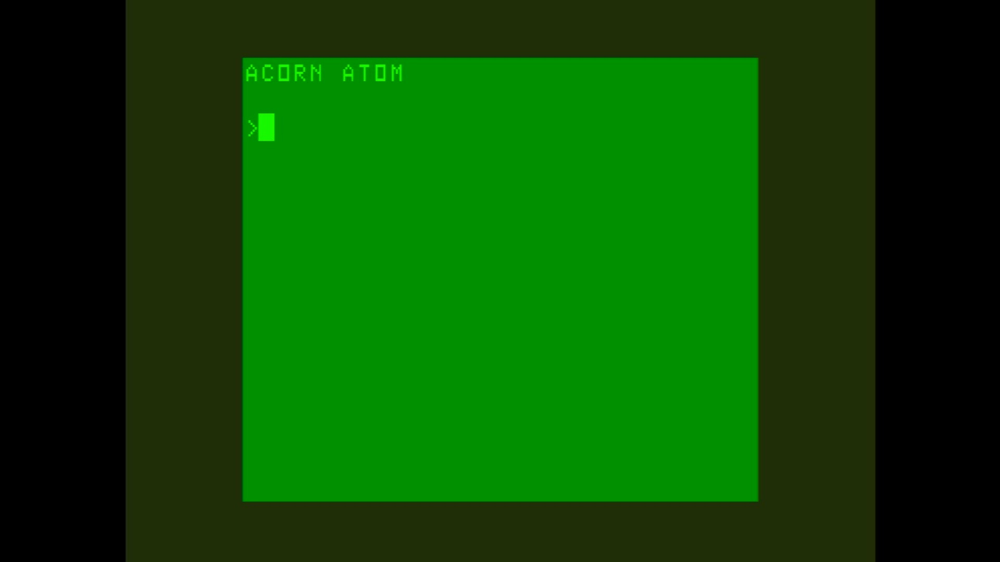

# Atom

- **`make kernel MACHINE=atom`** — Acorn
- **Year**: 1979
- **Manufacturer**: Acorn Computers

## At power-on

`Atom` at power-on on the real board — see the capture above.

## Required assets

- `roms/atom.zip`

  | ROM | CRC32 |
  |---|---|
  | `abasic.ic20` | `289b7791` |
  | `afloat.ic21` | `81d86af7` |
- `roms/atom_discpack.zip`

## Notes

- MAME driver: `atom.cpp`.

[← back to Acorn](README.md)
