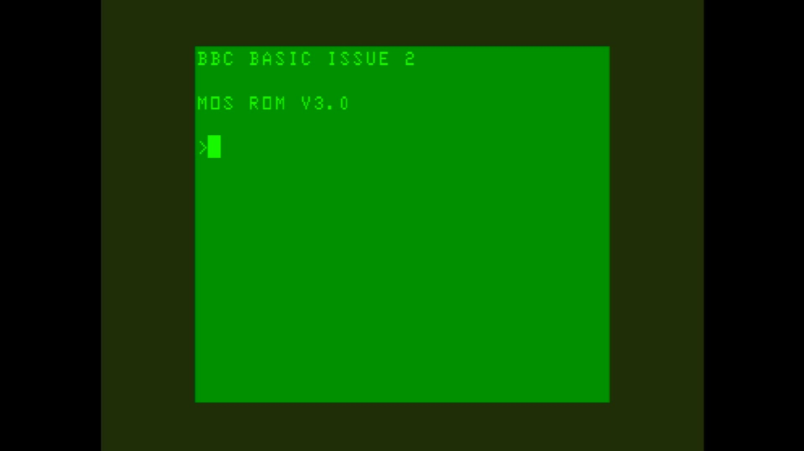

# Atom with BBC Basic

- **`make kernel MACHINE=atombbc`** — Acorn
- **Year**: 1982
- **Manufacturer**: Acorn Computers

## At power-on

`Atom with BBC Basic` at power-on on the real board — see the capture above.

## Required assets

- `roms/atombbc.zip`

  | ROM | CRC32 |
  |---|---|
  | `abasic.ic20` | `289b7791` |
  | `afloat.ic21` | `81d86af7` |
  | `mos3.rom` | `20158bd8` |
  | `bbcbasic.rom` | `79434781` |
- `roms/atom_discpack.zip`

## Notes

- MAME driver: `atom.cpp`.
- MAME clone of `atom` (Atom) — the system macro's parent field in the driver source. The ROM table above lists every member this machine's own zip needs.

[← back to Acorn](README.md)
