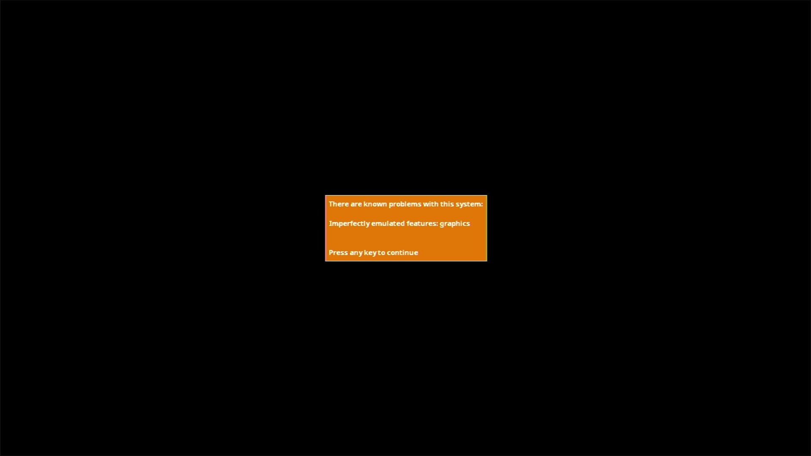

# Acorn Electron

- **`make kernel MACHINE=electron`** — Acorn
- **Year**: 1983
- **Manufacturer**: Acorn Computers

## At power-on

**PARKED** — stops at MAME's known-problems box (imperfectly emulated graphics). The capture above shows the observed stop; the machine is not offered until the park is lifted by a policy ruling.

## Required assets

- `roms/electron.zip`

  | ROM | CRC32 |
  |---|---|
  | `os_basic.ic2` | `b997f9cb` |
- `roms/electron_plus3.zip`
- `roms/electron_plus1.zip`

## Notes

- MAME driver: `electron.cpp`.

[← back to Acorn](README.md)
