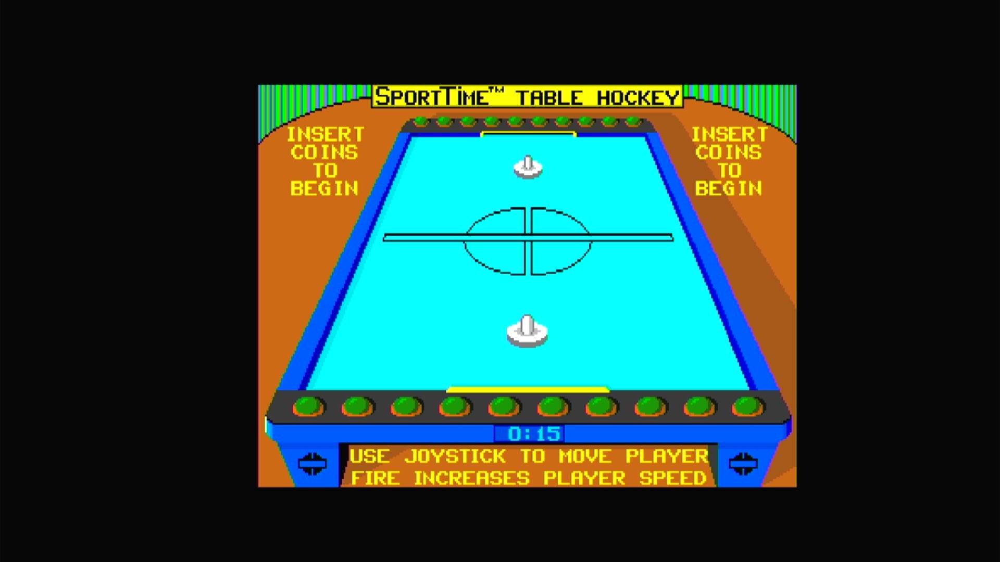

# SportTime Table Hockey (Arcadia, set 1, V 2.1)

- **`make kernel MACHINE=ar_airh`** — Amiga
- **Year**: 1988
- **Manufacturer**: Arcadia Systems
- **Television**: NTSC

## At power-on

`SportTime Table Hockey (Arcadia, set 1, V 2.1)` boots via the shared Arcadia System BIOS into its attract/title sequence — see the capture above.

## Required assets

- `roms/ar_airh.zip`

  | ROM | CRC32 |
  |---|---|
  | `airh_1h.bin` | `290e8e9e` |
  | `airh_1l.bin` | `155452b6` |
- `roms/ar_bios.zip` — the shared Arcadia System BIOS

## Notes

- Arcade coin-op on the Arcadia Multi Select hardware — an Amiga A500 motherboard driving an external ROM cage through the expansion port (see the driver header in `arsystems.cpp`) — hardware-proven on the Pi 4 bench.

[← back to Amiga](README.md)
