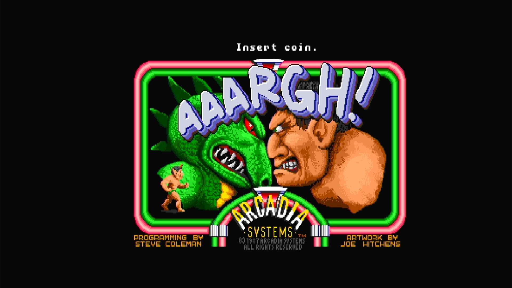

# Aaargh (Arcadia)

- **`make kernel MACHINE=ar_argh`** — Amiga
- **Year**: 1988
- **Manufacturer**: Arcadia Systems
- **Television**: NTSC

## At power-on

`Aaargh (Arcadia)` boots directly from its own Kickstart into its attract/title sequence (no shared OnePlay/TenPlay BIOS menu) — see the capture above.

## Required assets

- `roms/ar_argh.zip`

  | ROM | CRC32 |
  |---|---|
  | `315093-01.u2` | `a6ce1636` |
  | `argh-1-hi-11-28-87.u12` | `3b1f8075` |
  | `argh-1-lo-11-28-87.u16` | `78b77071` |
  | `argh-2-hi-11-28-87.u11` | `9604e1e9` |
  | `argh-2-lo-11-28-87.u15` | `0c7c8133` |
  | `argh-3-hi-11-28-87.u10` | `84d60a2c` |
  | `argh-3-lo-11-28-87.u14` | `f43a6107` |
  | `argh-4-hi-11-28-87.u9` | `7d9d514d` |
  | `argh-4-lo-11-28-87.u13` | `da797e5c` |
  | `argh-5-hi-11-28-87.u20` | `75a395c5` |
  | `argh-5-lo-11-28-87.u24` | `b69db0ed` |
  | `argh-6-hi-11-28-87.u19` | `f06ee4d5` |
  | `argh-6-lo-11-28-87.u23` | `9d49526a` |
  | `argh-7-hi-11-28-87.u18` | `2fda9f36` |
  | `argh-7-lo-11-28-87.u22` | `ad6f16d4` |
  | `argh-8-hi-11-28-87.u17` | `06be1705` |
  | `argh-8-lo-11-28-87.u21` | `48f7bed1` |
  | `argh-9-hi-11-28-87.u28` | `f6ef5a54` |
  | `argh-9-lo-11-28-87.u32` | `209fc834` |
  | `argh-10-hi-11-28-87.u27` | `e75c9ac1` |
  | `argh-10-lo-11-28-87.u31` | `dc4da335` |
  | `argh-11-hi-11-28-87.u26` | `2932054f` |
  | `argh-11-lo-11-28-87.u30` | `3ebf8c30` |
  | `argh-12-hi-11-28-87.u25` | `0e055d4a` |
  | `argh-12-lo-11-28-87.u29` | `940168b0` |
- `roms/ar_bios.zip` — the shared Arcadia System BIOS

## Notes

- Arcade coin-op on the Arcadia Multi Select hardware — an Amiga A500 motherboard driving an external ROM cage through the expansion port (see the driver header in `arsystems.cpp`) — hardware-proven on the Pi 4 bench.
- Plugs directly into the A500 motherboard with its own Kickstart copy — no shared OnePlay/TenPlay BIOS selection, unlike the rest of the roster (see the driver's comment on `ROM_START( ar_argh )`).

[← back to Amiga](README.md)
