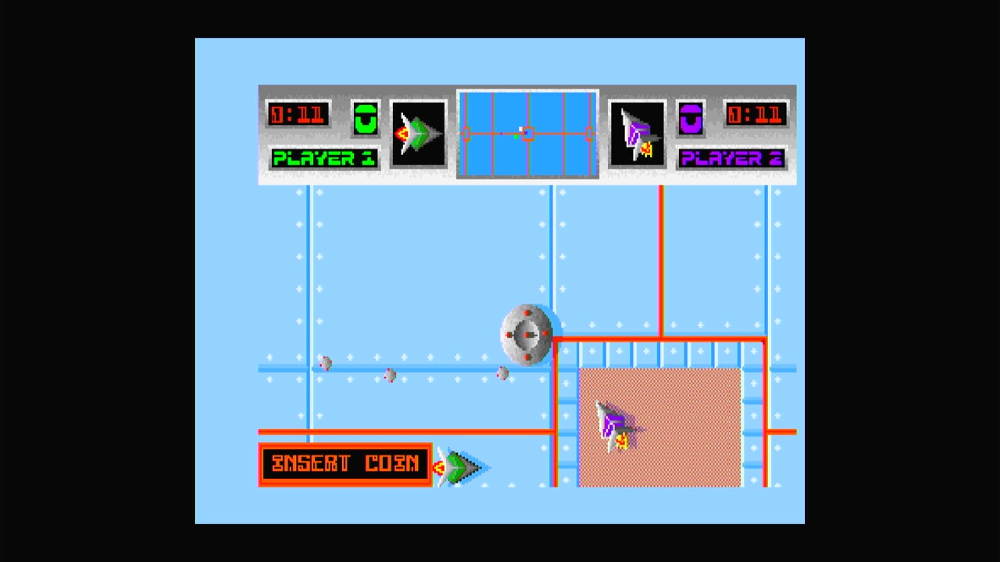

# Blastaball (Arcadia, V 2.1)

- **`make kernel MACHINE=ar_blast`** — Amiga
- **Year**: 1988
- **Manufacturer**: Arcadia Systems
- **Television**: NTSC

## At power-on

`Blastaball (Arcadia, V 2.1)` boots via the shared Arcadia System BIOS into its attract/title sequence — see the capture above.

## Required assets

- `roms/ar_blast.zip`

  | ROM | CRC32 |
  |---|---|
  | `blsb-v2-1_1-hi.bin` | `6d2e38e5` |
  | `blsb-v2-1_1-lo.bin` | `28b6db63` |
  | `blsb-v2-1_2-hi.bin` | `8b3c629c` |
  | `blsb-v2-1_2-lo.bin` | `966c733c` |
  | `blsb-v2-1_3-hi.bin` | `6013b0d2` |
  | `blsb-v2-1_3-lo.bin` | `8c5d602d` |
  | `blsb-v2-1_4-hi.bin` | `cc091362` |
  | `blsb-v2-1_4-lo.bin` | `16b7618a` |
- `roms/ar_bios.zip` — the shared Arcadia System BIOS

## Notes

- Arcade coin-op on the Arcadia Multi Select hardware — an Amiga A500 motherboard driving an external ROM cage through the expansion port (see the driver header in `arsystems.cpp`) — hardware-proven on the Pi 4 bench.

[← back to Amiga](README.md)
