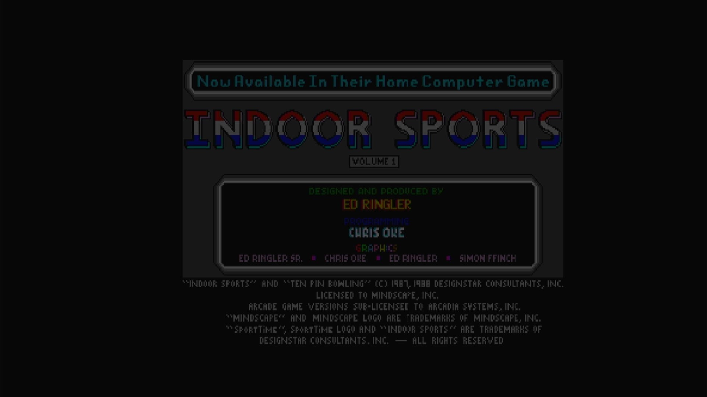

# SportTime Bowling (Arcadia, V 2.1)

- **`make kernel MACHINE=ar_bowl`** — Amiga
- **Year**: 1988
- **Manufacturer**: Arcadia Systems
- **Television**: NTSC

## At power-on

`SportTime Bowling (Arcadia, V 2.1)` boots via the shared Arcadia System BIOS into its attract/title sequence — see the capture above.

## Required assets

- `roms/ar_bowl.zip`

  | ROM | CRC32 |
  |---|---|
  | `bowl_1h.bin` | `c0c20422` |
  | `bowl_1l.bin` | `1c7fe75c` |
  | `bowl_2h.bin` | `a1e497d8` |
  | `bowl_2l.bin` | `ce23aa34` |
  | `bowl_3h.bin` | `0c55da71` |
  | `bowl_3l.bin` | `5ce00809` |
- `roms/ar_bios.zip` — the shared Arcadia System BIOS

## Notes

- Arcade coin-op on the Arcadia Multi Select hardware — an Amiga A500 motherboard driving an external ROM cage through the expansion port (see the driver header in `arsystems.cpp`) — hardware-proven on the Pi 4 bench.

[← back to Amiga](README.md)
