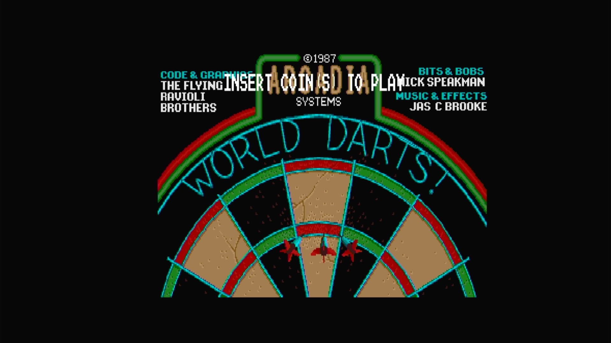

# World Darts (Arcadia, set 1, V 2.1)

- **`make kernel MACHINE=ar_dart`** — Amiga
- **Year**: 1987
- **Manufacturer**: Arcadia Systems
- **Television**: NTSC

## At power-on

`World Darts (Arcadia, set 1, V 2.1)` boots via the shared Arcadia System BIOS into its attract/title sequence — see the capture above.

## Required assets

- `roms/ar_dart.zip`

  | ROM | CRC32 |
  |---|---|
  | `dart_1h.bin` | `4d6a33e2` |
  | `dart_1l.bin` | `3fa66973` |
  | `dart_2h.bin` | `3a30426a` |
  | `dart_2l.bin` | `479c0b73` |
  | `dart_3h.bin` | `dd217562` |
  | `dart_3l.bin` | `12cff829` |
  | `dart_4h.bin` | `98b27f13` |
  | `dart_4l.bin` | `a059204c` |
  | `dart_5h.bin` | `38f4c236` |
  | `dart_5l.bin` | `df4103cc` |
  | `dart_6h.bin` | `e21cc8be` |
  | `dart_6l.bin` | `21112d4e` |
- `roms/ar_bios.zip` — the shared Arcadia System BIOS

## Notes

- Arcade coin-op on the Arcadia Multi Select hardware — an Amiga A500 motherboard driving an external ROM cage through the expansion port (see the driver header in `arsystems.cpp`) — hardware-proven on the Pi 4 bench.

[← back to Amiga](README.md)
