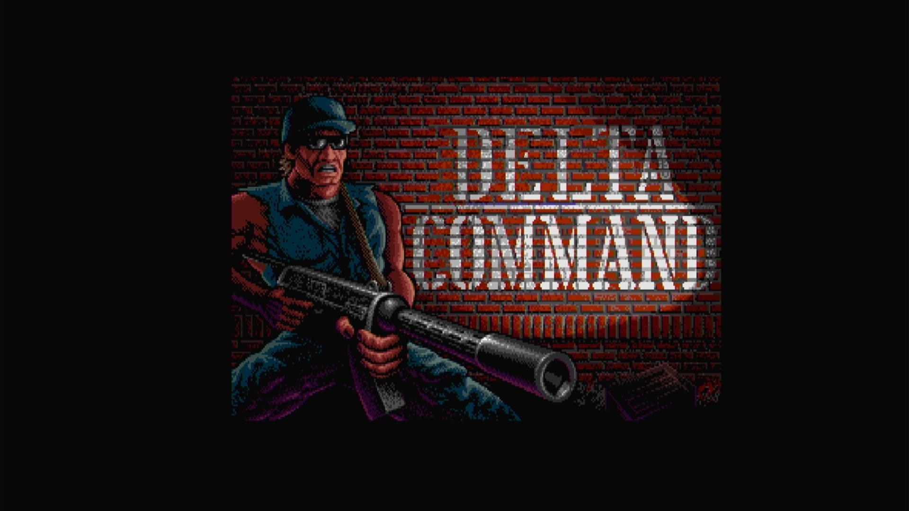

# Delta Command (Arcadia)

- **`make kernel MACHINE=ar_dlta`** — Amiga
- **Year**: 1988
- **Manufacturer**: Arcadia Systems
- **Television**: NTSC

## At power-on

`Delta Command (Arcadia)` boots via the shared Arcadia System BIOS into its attract/title sequence — see the capture above.

## Required assets

- `roms/ar_dlta.zip`

  | ROM | CRC32 |
  |---|---|
  | `dlta_v3_1-hi.bin` | `3d428b49` |
  | `dlta_v3_1-lo.bin` | `e5d6508b` |
  | `dlta_v3_2-hi.bin` | `e8a23dfe` |
  | `dlta_v3_2-lo.bin` | `84d82a8f` |
  | `dlta_v3_3-hi.bin` | `75563b80` |
  | `dlta_v3_3-lo.bin` | `30b911b2` |
  | `dlta_v3_4-hi.bin` | `80cd42a5` |
  | `dlta_v3_4-lo.bin` | `2fe13d9e` |
  | `dlta_v3_5-hi.bin` | `960c9a17` |
  | `dlta_v3_5-lo.bin` | `79cbc0dd` |
  | `dlta_v3_6-hi.bin` | `9df96431` |
  | `dlta_v3_6-lo.bin` | `5b0d7f30` |
  | `dlta_v3_7-hi.bin` | `8e966e69` |
  | `dlta_v3_7-lo.bin` | `42553743` |
  | `dlta_v3_8-hi.bin` | `9ef08c31` |
  | `dlta_v3_8-lo.bin` | `7088bb88` |
- `roms/ar_bios.zip` — the shared Arcadia System BIOS

## Notes

- Arcade coin-op on the Arcadia Multi Select hardware — an Amiga A500 motherboard driving an external ROM cage through the expansion port (see the driver header in `arsystems.cpp`) — hardware-proven on the Pi 4 bench.

[← back to Amiga](README.md)
