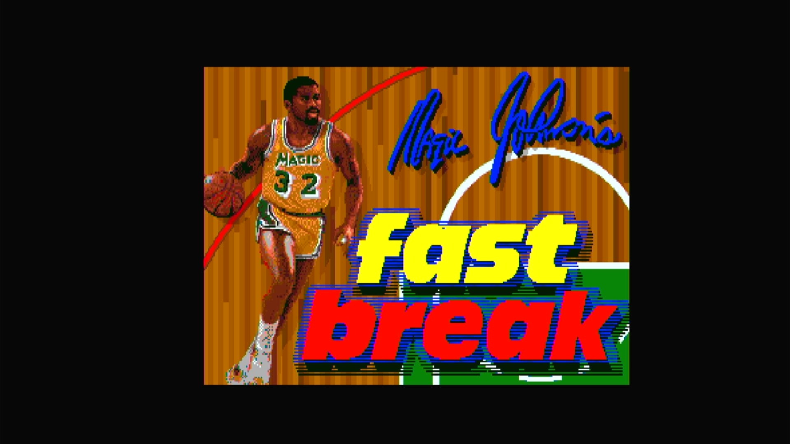

# Magic Johnson's Fast Break (Arcadia, V 2.8)

- **`make kernel MACHINE=ar_fast`** — Amiga
- **Year**: 1988
- **Manufacturer**: Arcadia Systems
- **Television**: NTSC

## At power-on

`Magic Johnson's Fast Break (Arcadia, V 2.8)` boots via the shared Arcadia System BIOS into its attract/title sequence — see the capture above.

## Required assets

- `roms/ar_fast.zip`

  | ROM | CRC32 |
  |---|---|
  | `fast-v28_1-hi.u11` | `091e4533` |
  | `fast-v28_1-lo.u15` | `8f7685c1` |
  | `fast-v28_2-hi.u10` | `3a3dd931` |
  | `fast-v28_2-lo.u14` | `4838d7e5` |
  | `fast-v28_3-hi.u9` | `db94fa62` |
  | `fast-v28_3-lo.u13` | `a400367d` |
  | `fast-v28_4-hi.u20` | `c0a021dd` |
  | `fast-v28_4-lo.u24` | `870e60f1` |
  | `fast-v28_5-hi.u19` | `6daf4817` |
  | `fast-v28_5-lo.u23` | `f489da29` |
  | `fast-v28_6-hi.u18` | `b23dbcfd` |
  | `fast-v28_6-lo.u22` | `4e23e807` |
  | `fast-v28_7-hi.u17` | `74d598eb` |
  | `fast-v28_7-lo.u21` | `b0649050` |
  | `fast-v28_8-hi.u28` | `3650aaf0` |
  | `fast-v28_8-lo.u32` | `82603f68` |
  | `pal16l8-sec-scpa.u8` | `3a4df3aa` |
- `roms/ar_bios.zip` — the shared Arcadia System BIOS

## Notes

- Arcade coin-op on the Arcadia Multi Select hardware — an Amiga A500 motherboard driving an external ROM cage through the expansion port (see the driver header in `arsystems.cpp`) — hardware-proven on the Pi 4 bench.

[← back to Amiga](README.md)
