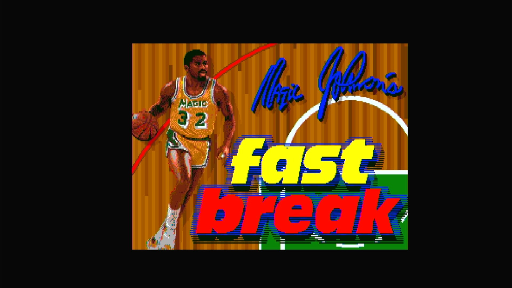

# Magic Johnson's Fast Break (Arcadia, V 2.7)

- **`make kernel MACHINE=ar_fasta`** — Amiga
- **Year**: 1988
- **Manufacturer**: Arcadia Systems
- **Television**: NTSC

## At power-on

`Magic Johnson's Fast Break (Arcadia, V 2.7)` boots via the shared Arcadia System BIOS into its attract/title sequence — see the capture above.

## Required assets

- `roms/ar_fasta.zip`

  | ROM | CRC32 |
  |---|---|
  | `fast-v27_1-hi.u11` | `58ce7e02` |
  | `fast-v27_1-lo.u15` | `6bf75490` |
  | `fast-v27_2-hi.u10` | `3a3dd931` |
  | `fast-v27_2-lo.u14` | `4838d7e5` |
  | `fast-v27_3-hi.u9` | `db94fa62` |
  | `fast-v27_3-lo.u13` | `a400367d` |
  | `fast-v27_4-hi.u20` | `c0a021dd` |
  | `fast-v27_4-lo.u24` | `870e60f1` |
  | `fast-v27_5-hi.u19` | `6daf4817` |
  | `fast-v27_5-lo.u23` | `f489da29` |
  | `fast-v27_6-hi.u18` | `e36424a4` |
  | `fast-v27_6-lo.u22` | `23441bac` |
  | `fast-v27_7-hi.u17` | `2ac2f165` |
  | `fast-v27_7-lo.u21` | `41255827` |
  | `fast-v27_8-hi.u28` | `8e838770` |
  | `fast-v27_8-lo.u32` | `2d55af35` |
  | `pal16l8-sec-scpa.u8` | `3a4df3aa` |
- `roms/ar_bios.zip` — the shared Arcadia System BIOS

## Notes

- Arcade coin-op on the Arcadia Multi Select hardware — an Amiga A500 motherboard driving an external ROM cage through the expansion port (see the driver header in `arsystems.cpp`) — hardware-proven on the Pi 4 bench.
- MAME clone of `ar_fast` (Magic Johnson's Fast Break (Arcadia, V 2.8)) — see the `GAME()` parent field in `arsystems.cpp`. Its own `ROM_START` fully lists every ROM this zip needs; none are borrowed from the parent zip.

[← back to Amiga](README.md)
