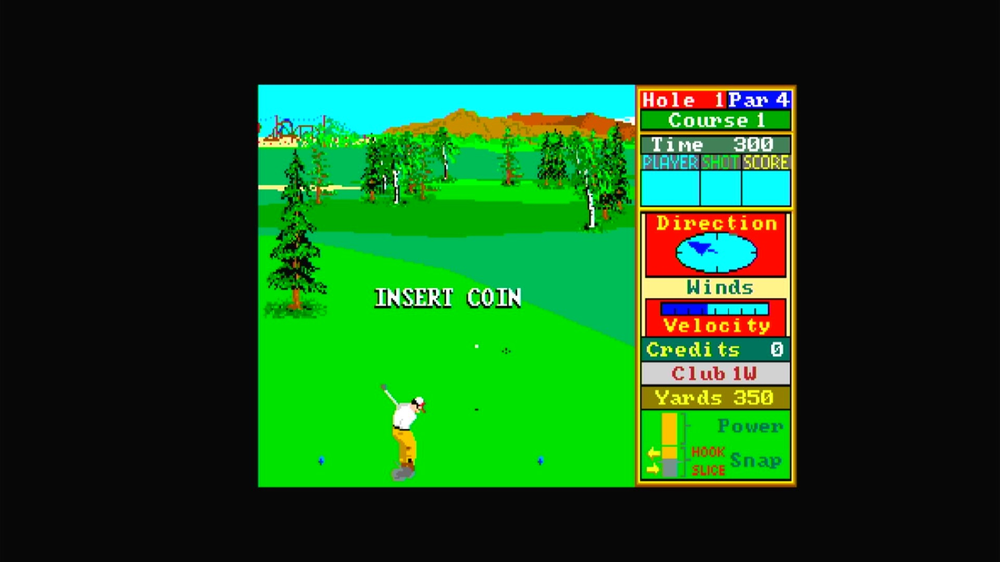

# Leader Board Golf (Arcadia, set 1, V 2.5)

- **`make kernel MACHINE=ar_ldrb`** — Amiga
- **Year**: 1988
- **Manufacturer**: Arcadia Systems
- **Television**: NTSC

## At power-on

`Leader Board Golf (Arcadia, set 1, V 2.5)` boots via the shared Arcadia System BIOS into its attract/title sequence — see the capture above.

## Required assets

- `roms/ar_ldrb.zip`

  | ROM | CRC32 |
  |---|---|
  | `leader_board_01-hi_v2.5.u11` | `0236511c` |
  | `leader_board_01-lo_v2.5.u15` | `786d34b9` |
  | `leader_board_02-hi_v2.5.u10` | `64e5fbae` |
  | `leader_board_02-lo_v2.5.u14` | `bb115e1c` |
  | `leader_board_03-hi_v2.5.u9` | `1d290e28` |
  | `leader_board_03-lo_v2.5.u13` | `b1352a77` |
  | `leader_board_04-hi_v2.5.u20` | `b621c688` |
  | `leader_board_04-lo_v2.5.u24` | `13f9c4b0` |
  | `leader_board_05-hi_v2.5.u19` | `71273172` |
  | `leader_board_05-lo_v2.5.u23` | `d9028183` |
  | `leader_board_06-hi_v2.5.u18` | `a6ce61a4` |
  | `leader_board_06-lo_v2.5.u22` | `13c71422` |
  | `leader_board_07-hi_v2.5.u17` | `4ebb8d12` |
  | `leader_board_07-lo_v2.5.u21` | `1afa9a4f` |
  | `leader_board_08-hi_v2.5.u28` | `fbdca9af` |
  | `leader_board_08-lo_v2.5.u32` | `322f52eb` |
  | `pal16l8-sec-scpa.u8` | `3a4df3aa` |
- `roms/ar_bios.zip` — the shared Arcadia System BIOS

## Notes

- Arcade coin-op on the Arcadia Multi Select hardware — an Amiga A500 motherboard driving an external ROM cage through the expansion port (see the driver header in `arsystems.cpp`) — hardware-proven on the Pi 4 bench.

[← back to Amiga](README.md)
