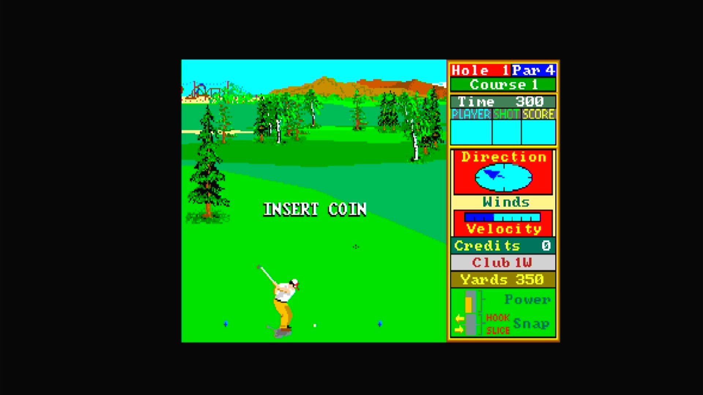

# Leader Board Golf (Arcadia, set 3)

- **`make kernel MACHINE=ar_ldrbb`** — Amiga
- **Year**: 1988
- **Manufacturer**: Arcadia Systems
- **Television**: NTSC

## At power-on

`Leader Board Golf (Arcadia, set 3)` boots via the shared Arcadia System BIOS into its attract/title sequence — see the capture above.

## Required assets

- `roms/ar_ldrbb.zip`

  | ROM | CRC32 |
  |---|---|
  | `ldrb_1h.u11` | `97dcde78` |
  | `ldrb_1l_gcp_22.u15` | `b51d17f7` |
  | `ldrb_2h.u10` | `64e5fbae` |
  | `ldrb_2l.u14` | `bb115e1c` |
  | `ldrb_3h.u9` | `1d290e28` |
  | `ldrb_3l.u13` | `b1352a77` |
  | `ldrb_4h.u20` | `b621c688` |
  | `ldrb_4l.u24` | `13f9c4b0` |
  | `ldrb_5h.u19` | `71273172` |
  | `ldrb_5l.u23` | `d9028183` |
  | `ldrb_6h.u18` | `a6ce61a4` |
  | `ldrb_6l.u22` | `13c71422` |
  | `ldrb_7h.u17` | `4ebb8d12` |
  | `ldrb_7l.u21` | `1afa9a4f` |
  | `ldrb_8h.u28` | `701f50ba` |
  | `ldrb_8l.u32` | `80642c1d` |
  | `pal16l8-sec-scpa.u8` | `3a4df3aa` |
- `roms/ar_bios.zip` — the shared Arcadia System BIOS

## Notes

- Arcade coin-op on the Arcadia Multi Select hardware — an Amiga A500 motherboard driving an external ROM cage through the expansion port (see the driver header in `arsystems.cpp`) — hardware-proven on the Pi 4 bench.
- MAME clone of `ar_ldrb` (Leader Board Golf (Arcadia, set 1, V 2.5)) — see the `GAME()` parent field in `arsystems.cpp`. Its own `ROM_START` fully lists every ROM this zip needs; none are borrowed from the parent zip.

[← back to Amiga](README.md)
