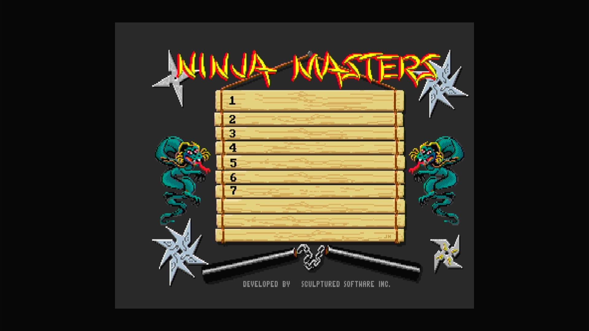

# Ninja Mission (Arcadia, set 1, V 2.5)

- **`make kernel MACHINE=ar_ninj`** — Amiga
- **Year**: 1987
- **Manufacturer**: Arcadia Systems
- **Television**: NTSC

## At power-on

`Ninja Mission (Arcadia, set 1, V 2.5)` boots via the shared Arcadia System BIOS into its attract/title sequence — see the capture above.

## Required assets

- `roms/ar_ninj.zip`

  | ROM | CRC32 |
  |---|---|
  | `ninj_1h.bin` | `53b07b4d` |
  | `ninj_1l.bin` | `3337a6c1` |
  | `ninj_2h.bin` | `e28a5fa8` |
  | `ninj_2l.bin` | `4f52c008` |
  | `ninj_3h.bin` | `c6e4dd36` |
  | `ninj_3l.bin` | `1dca7ea5` |
  | `ninj_4h.bin` | `dc1a21d4` |
  | `ninj_4l.bin` | `64660b15` |
  | `ninj_5h.bin` | `49cda31b` |
  | `ninj_5l.bin` | `1c5ef815` |
  | `ninj_6h.bin` | `b647f31e` |
  | `ninj_6l.bin` | `9e5407e3` |
- `roms/ar_bios.zip` — the shared Arcadia System BIOS

## Notes

- Arcade coin-op on the Arcadia Multi Select hardware — an Amiga A500 motherboard driving an external ROM cage through the expansion port (see the driver header in `arsystems.cpp`) — hardware-proven on the Pi 4 bench.

[← back to Amiga](README.md)
