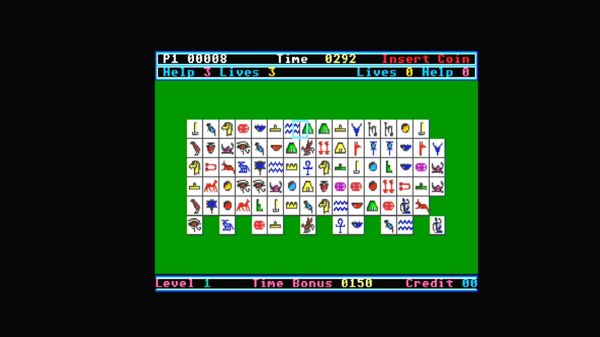

# Pharaohs Match (Arcadia)

- **`make kernel MACHINE=ar_pm`** — Amiga
- **Year**: 1988
- **Manufacturer**: Arcadia Systems
- **Television**: NTSC

## At power-on

`Pharaohs Match (Arcadia)` boots via the shared Arcadia System BIOS into its attract/title sequence — see the capture above.

## Required assets

- `roms/ar_pm.zip`

  | ROM | CRC32 |
  |---|---|
  | `pm-1hi.bin` | `ed65f3db` |
  | `pm-1lo.bin` | `7189a482` |
  | `pm-2hi.bin` | `a33fd701` |
  | `pm-2lo.bin` | `17dee8b9` |
- `roms/ar_bios.zip` — the shared Arcadia System BIOS

## Notes

- Arcade coin-op on the Arcadia Multi Select hardware — an Amiga A500 motherboard driving an external ROM cage through the expansion port (see the driver header in `arsystems.cpp`) — hardware-proven on the Pi 4 bench.

[← back to Amiga](README.md)
