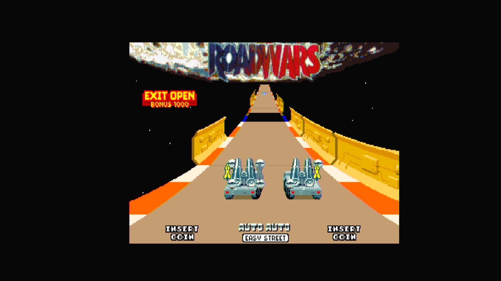

# RoadWars (Arcadia, V 2.3)

- **`make kernel MACHINE=ar_rdwr`** — Amiga
- **Year**: 1988
- **Manufacturer**: Arcadia Systems
- **Television**: NTSC

## At power-on

`RoadWars (Arcadia, V 2.3)` boots via the shared Arcadia System BIOS into its attract/title sequence — see the capture above.

## Required assets

- `roms/ar_rdwr.zip`

  | ROM | CRC32 |
  |---|---|
  | `rdwr_1h.bin` | `f52cb704` |
  | `rdwr_1l.bin` | `fde0de6d` |
  | `rdwr_2h.bin` | `8f3c1a2c` |
  | `rdwr_2l.bin` | `21865e15` |
  | `rdwr_3h.bin` | `0cb3bc66` |
  | `rdwr_3l.bin` | `d863a958` |
  | `rdwr_4h.bin` | `466fe771` |
  | `rdwr_4l.bin` | `fff39238` |
- `roms/ar_bios.zip` — the shared Arcadia System BIOS

## Notes

- Arcade coin-op on the Arcadia Multi Select hardware — an Amiga A500 motherboard driving an external ROM cage through the expansion port (see the driver header in `arsystems.cpp`) — hardware-proven on the Pi 4 bench.

[← back to Amiga](README.md)
