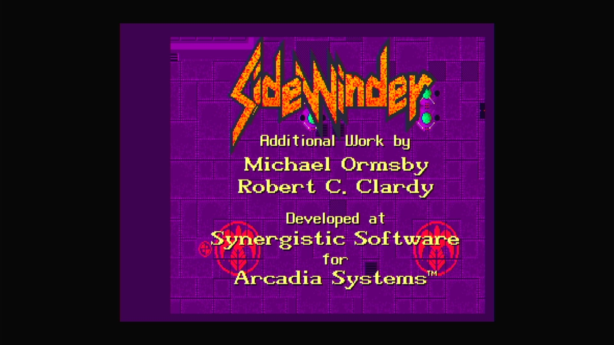

# Sidewinder (Arcadia, set 1, V 2.1)

- **`make kernel MACHINE=ar_sdwr`** — Amiga
- **Year**: 1988
- **Manufacturer**: Arcadia Systems
- **Television**: NTSC

## At power-on

`Sidewinder (Arcadia, set 1, V 2.1)` boots via the shared Arcadia System BIOS into its attract/title sequence — see the capture above.

## Required assets

- `roms/ar_sdwr.zip`

  | ROM | CRC32 |
  |---|---|
  | `sdwr_1h.bin` | `aef3eea8` |
  | `sdwr_1l.bin` | `daed4add` |
  | `sdwr_2h.bin` | `d67ba564` |
  | `sdwr_2l.bin` | `97f58a6d` |
  | `sdwr_3h.bin` | `b31ad2b2` |
  | `sdwr_3l.bin` | `af929620` |
  | `sdwr_4h.bin` | `7502a271` |
  | `sdwr_4l.bin` | `942d50b4` |
  | `sdwr_5h.bin` | `c25ac91d` |
  | `sdwr_5l.bin` | `ecd1fbd3` |
  | `sdwr_6h.bin` | `ea3c8ab3` |
  | `sdwr_6l.bin` | `2544ccd7` |
- `roms/ar_bios.zip` — the shared Arcadia System BIOS

## Notes

- Arcade coin-op on the Arcadia Multi Select hardware — an Amiga A500 motherboard driving an external ROM cage through the expansion port (see the driver header in `arsystems.cpp`) — hardware-proven on the Pi 4 bench.

[← back to Amiga](README.md)
