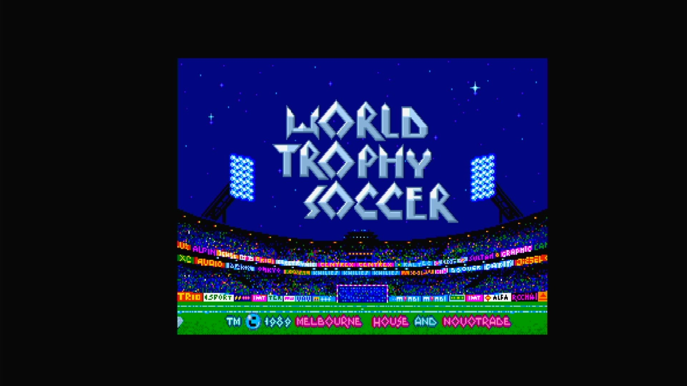

# World Trophy Soccer (Arcadia, V 3.0)

- **`make kernel MACHINE=ar_socc`** — Amiga
- **Year**: 1989
- **Manufacturer**: Arcadia Systems
- **Television**: NTSC

## At power-on

`World Trophy Soccer (Arcadia, V 3.0)` boots via the shared Arcadia System BIOS into its attract/title sequence — see the capture above.

## Required assets

- `roms/ar_socc.zip`

  | ROM | CRC32 |
  |---|---|
  | `socc30.1hi` | `b4df41cf` |
  | `socc30.1lo` | `28b5e119` |
  | `socc30.2hi` | `b3c14026` |
  | `socc30.2lo` | `f7f9a734` |
  | `socc30.3hi` | `2a2bd2a0` |
  | `socc30.3lo` | `f335bb8b` |
  | `socc30.4hi` | `4f2f28dc` |
  | `socc30.4lo` | `b326d36c` |
  | `socc30.5hi` | `4fcaec4a` |
  | `socc30.5lo` | `f131115e` |
  | `socc30.6hi` | `9380644f` |
  | `socc30.6lo` | `b93e13ea` |
- `roms/ar_bios.zip` — the shared Arcadia System BIOS

## Notes

- Arcade coin-op on the Arcadia Multi Select hardware — an Amiga A500 motherboard driving an external ROM cage through the expansion port (see the driver header in `arsystems.cpp`) — hardware-proven on the Pi 4 bench.

[← back to Amiga](README.md)
