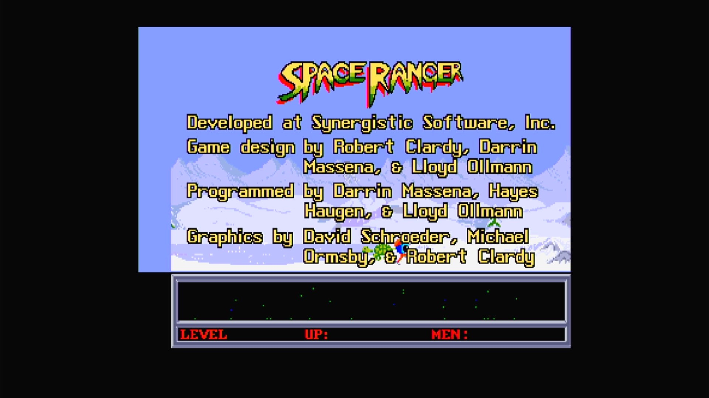

# Space Ranger (Arcadia, V 2.0)

- **`make kernel MACHINE=ar_sprg`** — Amiga
- **Year**: 1987
- **Manufacturer**: Arcadia Systems
- **Television**: NTSC

## At power-on

`Space Ranger (Arcadia, V 2.0)` boots via the shared Arcadia System BIOS into its attract/title sequence — see the capture above.

## Required assets

- `roms/ar_sprg.zip`

  | ROM | CRC32 |
  |---|---|
  | `sprg_1h.bin` | `90b45dc5` |
  | `sprg_1l.bin` | `e5ce68e9` |
  | `sprg_2h.bin` | `02ef780f` |
  | `sprg_2l.bin` | `fa1f5b23` |
  | `sprg_3h.bin` | `48130e6e` |
  | `sprg_3l.bin` | `4b968cc6` |
  | `sprg_4h.bin` | `23c8f667` |
  | `sprg_4l.bin` | `13ba011f` |
- `roms/ar_bios.zip` — the shared Arcadia System BIOS

## Notes

- Arcade coin-op on the Arcadia Multi Select hardware — an Amiga A500 motherboard driving an external ROM cage through the expansion port (see the driver header in `arsystems.cpp`) — hardware-proven on the Pi 4 bench.

[← back to Amiga](README.md)
