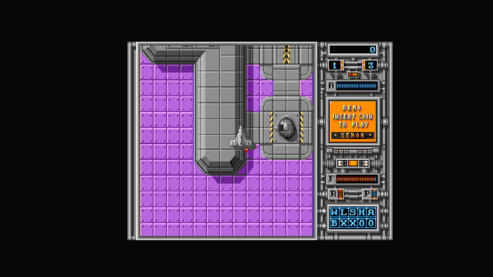

# Xenon (Arcadia, V 2.3)

- **`make kernel MACHINE=ar_xeon`** — Amiga
- **Year**: 1988
- **Manufacturer**: Arcadia Systems
- **Television**: NTSC

## At power-on

`Xenon (Arcadia, V 2.3)` boots via the shared Arcadia System BIOS into its attract/title sequence — see the capture above.

## Required assets

- `roms/ar_xeon.zip`

  | ROM | CRC32 |
  |---|---|
  | `xeon_1h.bin` | `ca422811` |
  | `xeon_1l.bin` | `97edf967` |
  | `xeon_2h.bin` | `8078c10e` |
  | `xeon_2l.bin` | `a8845d8f` |
  | `xeon_3h.bin` | `9d013152` |
  | `xeon_3l.bin` | `331b1449` |
  | `xeon_4h.bin` | `fbf43d5c` |
  | `xeon_4l.bin` | `47b60bf5` |
- `roms/ar_bios.zip` — the shared Arcadia System BIOS

## Notes

- Arcade coin-op on the Arcadia Multi Select hardware — an Amiga A500 motherboard driving an external ROM cage through the expansion port (see the driver header in `arsystems.cpp`) — hardware-proven on the Pi 4 bench.

[← back to Amiga](README.md)
