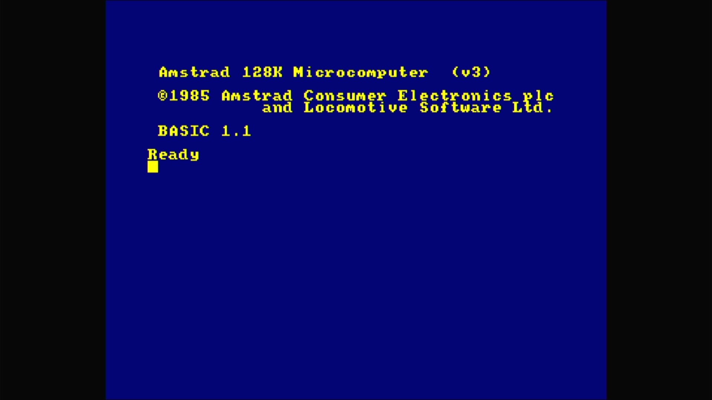

# Amstrad CPC6128

- **`make MACHINE=cpc6128`** — Amstrad
- **Year**: 1985
- **Manufacturer**: Amstrad plc
- **Television**: PAL

## At power-on

The 128K disk-based CPC, a cpc464 clone with 128K of RAM and a built-in 3" floppy drive, boots to Locomotive BASIC 1.1: the yellow-on-blue `Amstrad 128K Microcomputer (v3)` / `©1985 Amstrad Consumer Electronics plc and Locomotive Software Ltd.` sign-on over `BASIC 1.1` / `Ready`, on the PAL canvas.

## Required assets

- `roms/cpc6128.zip`

  | ROM | CRC32 |
  |---|---|
  | `cpc6128.rom` | `9e827fe1` |
  | `cpcados.rom` | `1fe22ecd` |

[← back to Amstrad](README.md)
