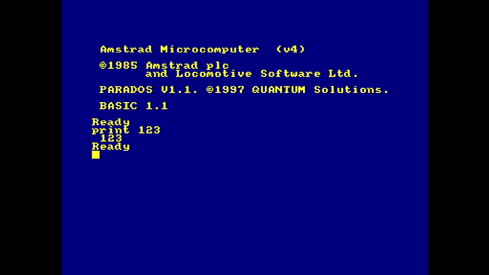
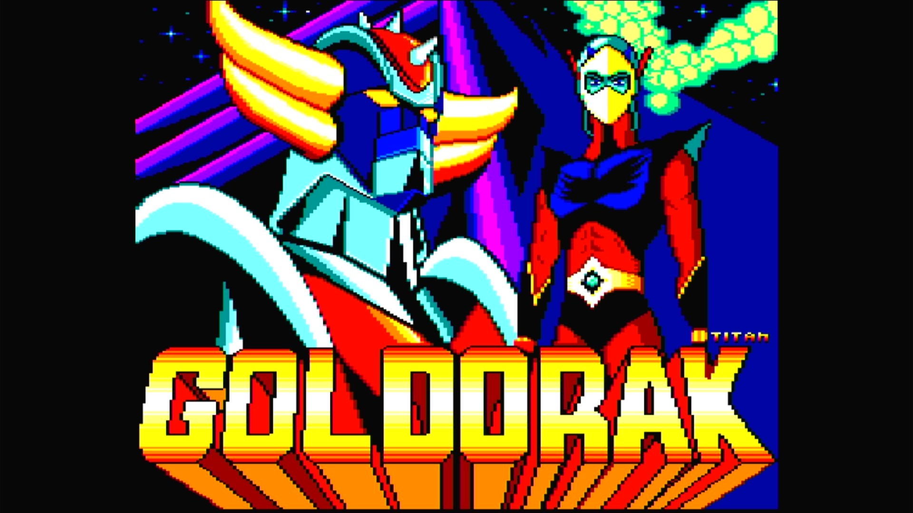

# Amstrad CPC6128+

- **`make kernel MACHINE=cpc6128p`** — Amstrad
- **Year**: 1990
- **Manufacturer**: Amstrad plc
- **Television**: PAL

## At power-on

The 128K Plus-range CPC, whose hardware boots from a cartridge: the image bakes `-cart /media/cart/cpc6128p/sysukpd.bin` (the game-free Locomotive BASIC + ParaDOS cart), which signs on yellow-on-blue as `Amstrad Microcomputer (v4)` / `©1985 Amstrad plc and Locomotive Software Ltd.` / `PARADOS V1.1. ©1997 QUANTUM Solutions.` over `BASIC 1.1` / `Ready`, on the PAL canvas — byte-identical to the `cpc464p` sign-on, because it comes from the cart, not the board.

## Required assets

No romset zip: the `cpc6128p` romset is empty.

- `media/cart/cpc6128p/sysukpd.bin`

## Notes

- MAME driver: `amstrad.cpp`.
- Other carts load through MAME's UI at runtime (Scroll Lock → Tab → file manager).

## Booting media

Goldorak (Titan, freeware fan game) auto-booted from a CPC+ cartridge (`.cpr`), showing its title screen.

[← back to Amstrad](README.md)
