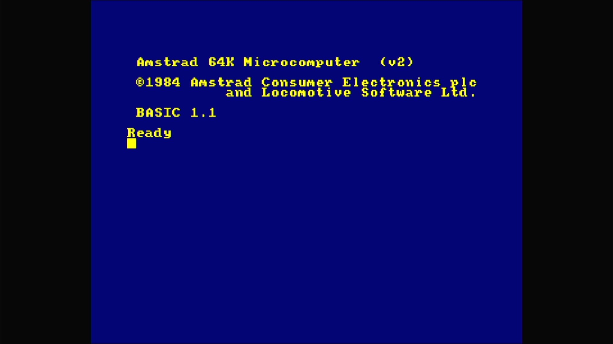

# Amstrad CPC664

- **`make kernel MACHINE=cpc664`** — Amstrad
- **Year**: 1985
- **Manufacturer**: Amstrad plc
- **Television**: PAL

## At power-on

The short-lived disk-based CPC, a cpc464 clone with a built-in 3" floppy drive, boots to Locomotive BASIC 1.1: the yellow-on-blue `Amstrad 64K Microcomputer (v2)` / `©1984 Amstrad Consumer Electronics plc and Locomotive Software Ltd.` sign-on over `BASIC 1.1` / `Ready`, on the PAL canvas.

## Required assets

- `roms/cpc664.zip`

  | ROM | CRC32 |
  |---|---|
  | `cpc664.rom` | `9ab5a036` |
  | `cpcados.rom` | `1fe22ecd` |

[← back to Amstrad](README.md)
