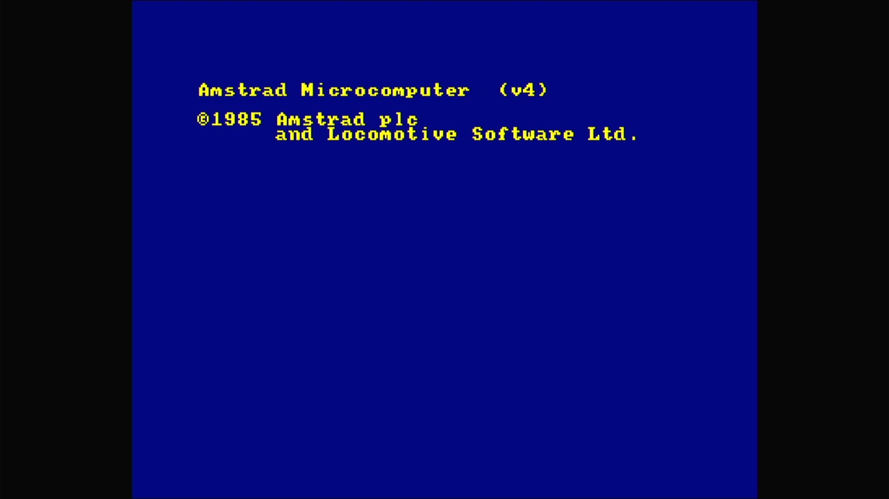
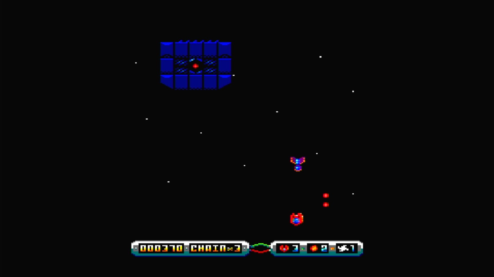

# Amstrad GX4000

- **`make MACHINE=gx4000`** — Amstrad
- **Year**: 1990
- **Manufacturer**: Amstrad plc
- **Television**: PAL

## At power-on

The keyboard-less games console of the Plus range, whose hardware boots from a cartridge: the image bakes `-cart /carts/sysukpd.bin` (the game-free Locomotive BASIC + ParaDOS cart), which renders `Amstrad Microcomputer (v4)` / `©1985 Amstrad plc and Locomotive Software Ltd.` and halts at that sign-on — with no keyboard, the console does not drop into BASIC; it awaits a game cart. That is its correct power-on state, on the PAL canvas.

## Required assets

No romset zip: the `gx4000` romset is empty — the Plus firmware lives on the cartridge.

- `carts/sysukpd.bin` — the baked default cartridge, Locomotive BASIC + ParaDOS (MAME softlist entry `sysukpd`: `engpados.bin`, renamed)

  | File | CRC32 |
  |---|---|
  | `sysukpd.bin` | `e9c5e30e` |

## Notes

- Other carts load through MAME's UI at runtime (Scroll Lock → Tab → file manager).

## Booting media

Fit a game cartridge and the GX4000 boots straight into it — no keyboard,
no load command. Shown: **Hyperdrive** (Juan J. Martínez, CC BY-NC-SA 4.0),
a native GX4000 / CPC Plus vertical shoot-'em-up, auto-booting from its
`.cpr` cartridge into gameplay.

[← back to Amstrad](README.md)
