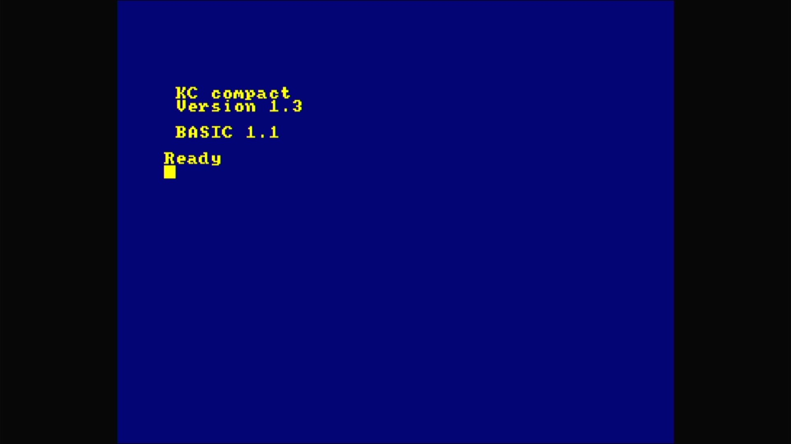

# KC Compact

- **`make kernel MACHINE=kccomp`** — Amstrad
- **Year**: 1989
- **Manufacturer**: VEB Mikroelektronik "Wilhelm Pieck" Mühlhausen
- **Television**: PAL

## At power-on

The East German CPC clone — a cpc464 clone whose reworked firmware carries its own maker's sign-on, the yellow-on-blue `KC compact` / `Version 1.3` above `BASIC 1.1` and `Ready`, on the PAL canvas.

## Required assets

- `roms/kccomp.zip`

  | ROM | CRC32 |
  |---|---|
  | `kccos.rom` | `7f9ab3f7` |
  | `kccbas.rom` | `ca6af63d` |
  | `farben.rom` | `a50fa3cf` |

## Notes

- `farben.rom` is the colour PROM.

[← back to Amstrad](README.md)
