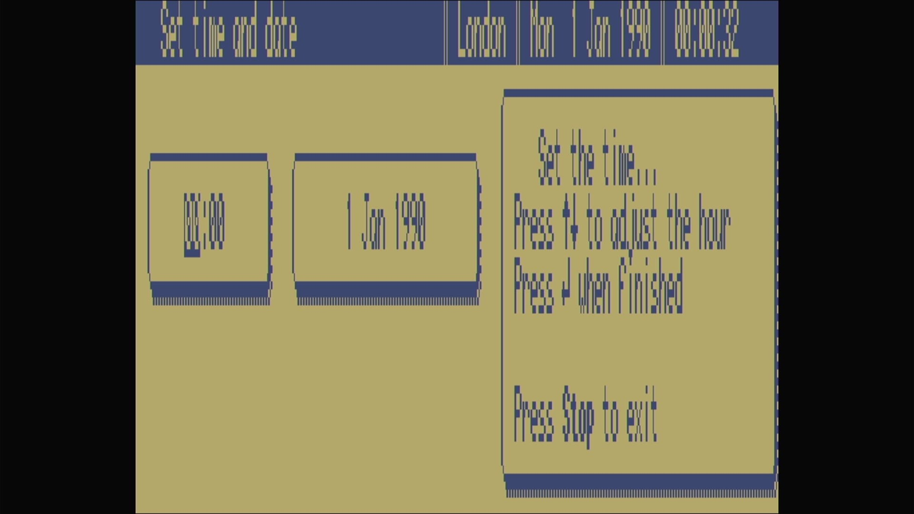

# Amstrad NC100

- **`make kernel MACHINE=nc100`** — Amstrad
- **Year**: 1992
- **Manufacturer**: Amstrad plc
- **Television**: PAL

## At power-on

A Z80-based A4 notepad computer, powers on to its `Set time and date` screen: a `London` / `Mon 1 Jan 1990` status bar above a time box (`00:00`) and a date box (`1 Jan 1990`), with the prompt `Set the time...` / `Press ↑↓ to adjust the hour` / `Press J when finished` / `Press Stop to exit`, in the LCD's blue-on-tan, stretched to fill the PAL canvas.

## Required assets

- `roms/nc100.zip`

  | ROM | CRC32 |
  |---|---|
  | `nc100a.rom` | `849884f9` |

## Notes

- Own 480×64 monochrome LCD and built-in organiser firmware — not a CPC, the same maker's later portable.
- Battery-backed memory: shut it down with its own **On/Off** key before removing power and it keeps its clock and memory, warm-booting straight to the main menu next time. Cut the power mid-session and it forgets — coming back to this Set-time screen with the clock reset, exactly as the real NC100 did. Faithful modelling, not a bug.

[← back to Amstrad](README.md)
