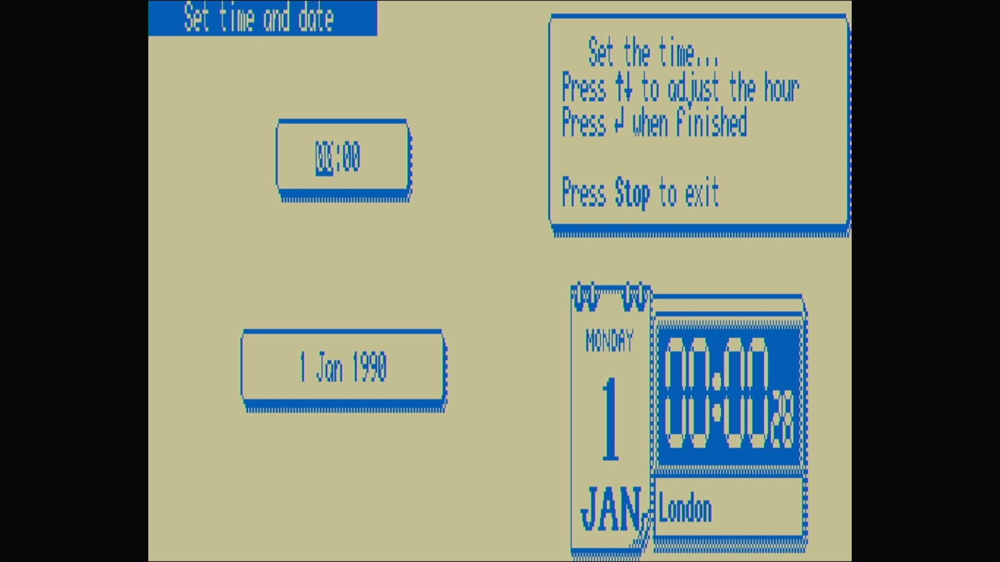

# Amstrad NC200

- **`make kernel MACHINE=nc200`** — Amstrad
- **Year**: 1993
- **Manufacturer**: Amstrad plc
- **Television**: PAL

## At power-on

The NC100's successor — a taller 480×128 LCD and a built-in 3½″ floppy drive — powers on to the same `Set time and date` first-run screen: the `Set time and date` title bar, a time box (`00:00`) and a date box (`1 Jan 1990`), the prompt `Set the time...` / `Press ↑↓ to adjust the hour` / `Press ↵ when finished` / `Press Stop to exit`, and a live `MONDAY 1 JAN` / `London` calendar-clock widget ticking away, in the LCD's blue-on-tan, stretched to fill the PAL canvas.

## Required assets

- `roms/nc200.zip`

  | ROM | CRC32 |
  |---|---|
  | `amstrad_nc200_v202.rom` | `0919efba` |

## Notes

- Battery-backed memory: shut it down with its own **On/Off** key before removing power and it keeps its clock and memory, warm-booting straight to the main menu next time. Cut the power mid-session and it forgets — coming back to this Set-time screen with the clock reset, exactly as the real NC200 did. Faithful modelling, not a bug.

[← back to Amstrad](README.md)
