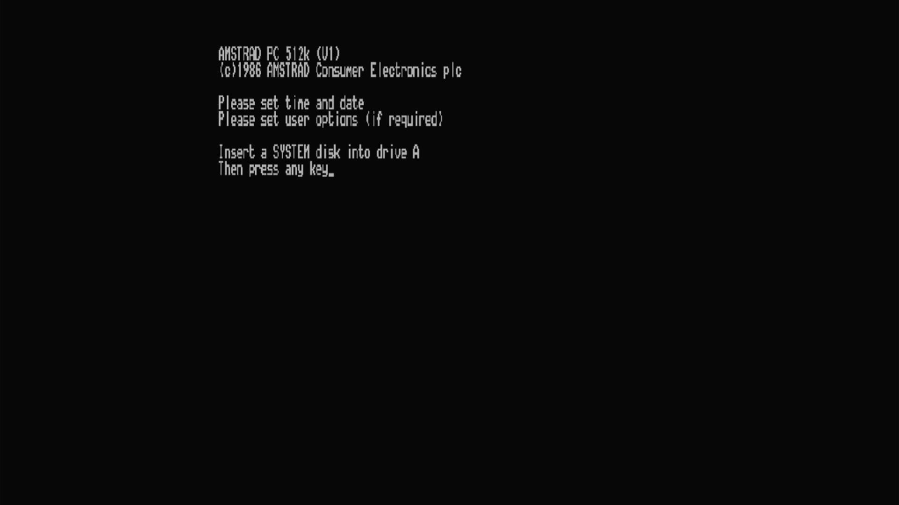

# Amstrad PC1512 SD

- **`make MACHINE=pc1512`** — Amstrad
- **Year**: 1986
- **Manufacturer**: Amstrad plc
- **Television**: PAL

## At power-on

Amstrad's 8086 IBM PC-compatible, the first x86 machine in the set, powers on through its ROM BIOS self-test to the `AMSTRAD PC 512k (V1)` / `(c)1986 AMSTRAD Consumer Electronics plc` sign-on and, with no floppy or hard media shipped, `Please set time and date` / `Please set user options (if required)` above `Insert a SYSTEM disk into drive A` / `Then press any key`, on the PAL canvas.

## Required assets

- `roms/pc1512.zip`

  | ROM | CRC32 |
  |---|---|
  | `40044.ic132` | `f72f1582` |
  | `40043.ic129` | `668fcc94` |
  | `40045.ic127` | `dd5e030f` |
- `roms/pc1512kb.zip` — the `40042.ic801` keyboard-controller ROM

## Booting media

FreeDOS (GPL) auto-booting from a 360K floppy in drive A: to the `A:\>`
prompt — the PC1512's IBM-PC-XT-class BIOS treats it like any DOS floppy.

[← back to Amstrad](README.md)
