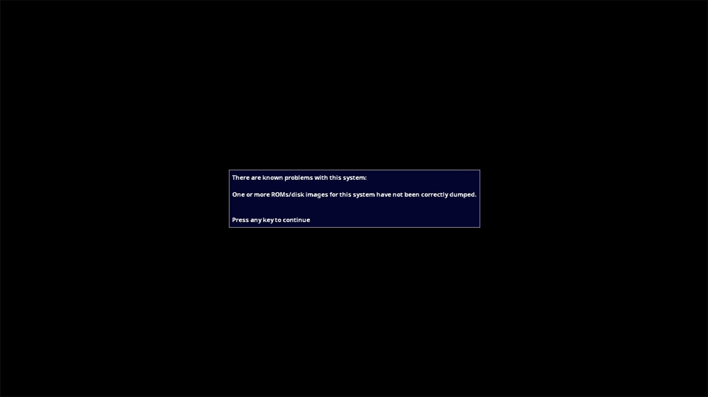

# Atari 400 (NTSC)

- **`make kernel MACHINE=a400`** — Atari
- **Year**: 1979
- **Manufacturer**: Atari

## At power-on

**PARKED** — stops at MAME's known-problems box (BAD_DUMP OS ROMs: "One or more ROMs/disk images for this system have not been correctly dumped"). The capture above shows the observed stop; the machine is not offered until the park is lifted by a policy ruling.

## Required assets

- `roms/a400.zip`

  | ROM | CRC32 |
  |---|---|
  | `co12399b.rom` | `6a5d766e` |
  | `co12499b.rom` | `d818f3e8` |
  | `co14599b.rom` | `c1690a9b` |
  | `co12499a.rom` | `29f64e17` |
  | `co14599a.rom` | `bc533f0c` |

## Notes

- MAME driver: `atari400.cpp`.

[← back to Atari](README.md)
