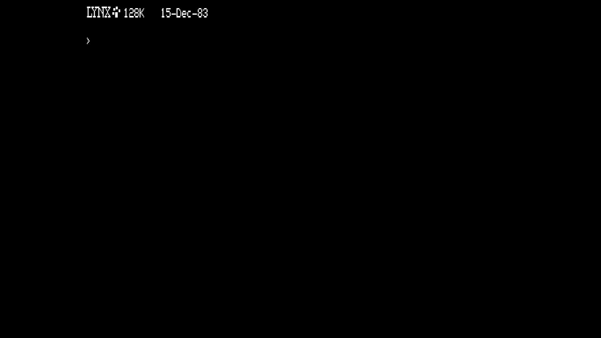

# Lynx 128k

- **`make kernel MACHINE=lynx128k`** — Camputers
- **Year**: 1983
- **Manufacturer**: Camputers

## At power-on

`Lynx 128k` at power-on on the real board — see the capture above.

## Required assets

- `roms/lynx128k.zip`

  | ROM | CRC32 |
  |---|---|
  | `lynx128-1.ic1` | `65d292ce` |
  | `lynx128-2.ic2` | `23288773` |
  | `lynx128-3.ic3` | `9827b9e9` |
  | `dosrom.rom` | `011e106a` |

## Notes

- MAME driver: `camplynx.cpp`.
- MAME clone of `lynx48k` (Lynx 48k) — the system macro's parent field in the driver source. The ROM table above lists every member this machine's own zip needs.

[← back to Camputers](README.md)
