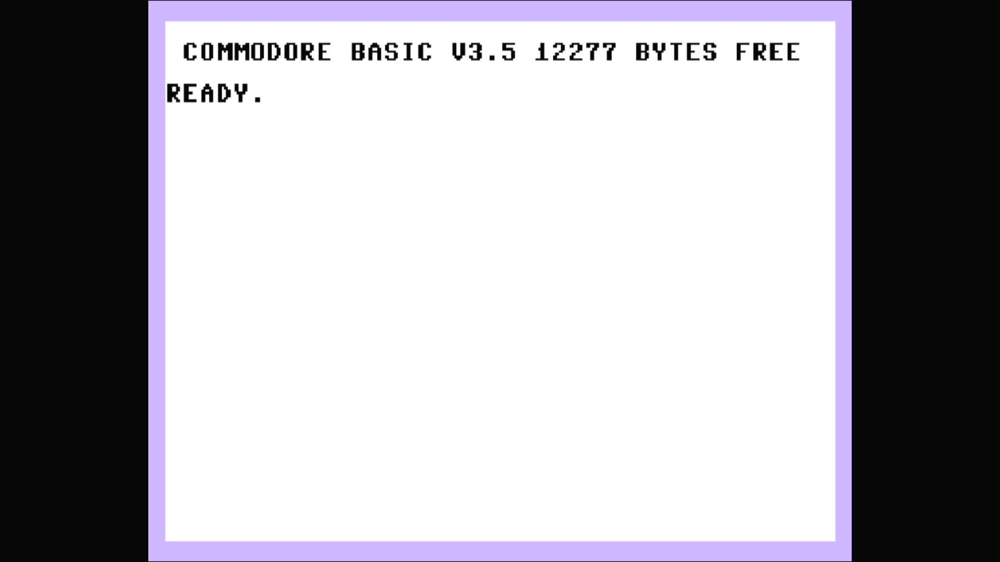

# Commodore 116

- **`make kernel MACHINE=c116`** — Commodore
- **Year**: 1984
- **Manufacturer**: Commodore Business Machines
- **Television**: PAL

## At power-on

The Commodore 116 was the cheapest member of Commodore's 1984 "264 series" — the cost-reduced, **rubber-keyboard** variant of the Commodore 16, sold almost exclusively in Europe. Where the C16 wore a full breadbox-style case with proper keys, the C116 crammed the same electronics into a smaller wedge with a calculator-style rubber mat, aimed squarely at the very bottom of the home market. Inside it is the same machine: the MOS **TED** (7360/8360) chip handling video, sound and I/O in a single part, the same 7501/8501 CPU, the same `plus4.cpp` driver lineage, and the same **16 KB of RAM** with no application ROMs. It boots straight to the sign-on and `READY.` prompt, here reading **`COMMODORE BASIC V3.5`** with **`12277 BYTES FREE`** — identical to the C16, because the romset is identical to the C16's. It runs the same **BASIC 3.5** as the Plus/4 (a substantially richer dialect than the C64/VIC-20's BASIC 2.0, with graphics, sound and disk commands built in), but with only 16 KB of RAM it frees just 12277 bytes to the user, against the Plus/4's 60671. There is **no `3-PLUS-1 ON KEY F1` line** — like the C16 the C116 has no function ROMs, so the productivity suite the Plus/4 advertises simply does not exist here. This is a **PAL** machine, filling the wider **720x576 PAL canvas**. The glass shows the same **TED pastel palette** as the rest of the 264 line — a pale lavender border around a white screen with black text — visually unlike anything else on this appliance's Commodore platform (the C64's blue-on-blue, the VIC-20's cyan-and-white). It is driven by the TED/264 driver (`src/mame/commodore/plus4.cpp`), the same family as the Plus/4 but a distinct machine (`c16_state`, machine config `c16p` — it shares the PAL C16's config). None of it comes from `c64.cpp` or `vic20.cpp`. MAME flags this driver `MACHINE_SUPPORTS_SAVE` only (no imperfect-graphics or imperfect-sound warning), and it boots straight through to BASIC with no warnings box.

## Required assets

- `roms/c116.zip`

  | ROM | CRC32 |
  |---|---|
  | `318006-01.u3` (kernal) | `74eaae87` |
  | `318004-03.u4` (kernal) | `77bab934` |
  | `318004-04.u4` (kernal) | `be54ed79` |
  | `318004-05.u4` (kernal) | `71c07bd4` |
  | `251641-02.u101` | `83be2076` |

## Notes

- MAME driver: `plus4.cpp`.
- MAME clone of `c264` (Commodore 264 (Prototype)) — the system macro's parent field in the driver source. The ROM table above lists every member this machine's own zip needs.
- **16 KB of RAM, and the sign-on says so.** The `12277 BYTES FREE` on the glass is the machine's defining fact — a quarter of the Plus/4's free memory. Any BASIC program written here lives inside that 12 KB.
- **Same romset as the C16, different case.** The C116's distinction from the C16 is physical — a smaller wedge with a rubber-mat keyboard — not electronic. MAME models it as the same `c16_state` on the `c16p` machine config, so what reaches the glass is pixel-identical to the C16 (PAL). The romset differs from `c16p` by exactly one member filename (the PLA).
- **No 3-PLUS-1 suite.** Unlike the Plus/4, the C116 has no built-in productivity ROMs, which is why the power-on sign-on offers no function-key application — the driver's romset carries no "function" region at all.

[← back to Commodore](README.md)
