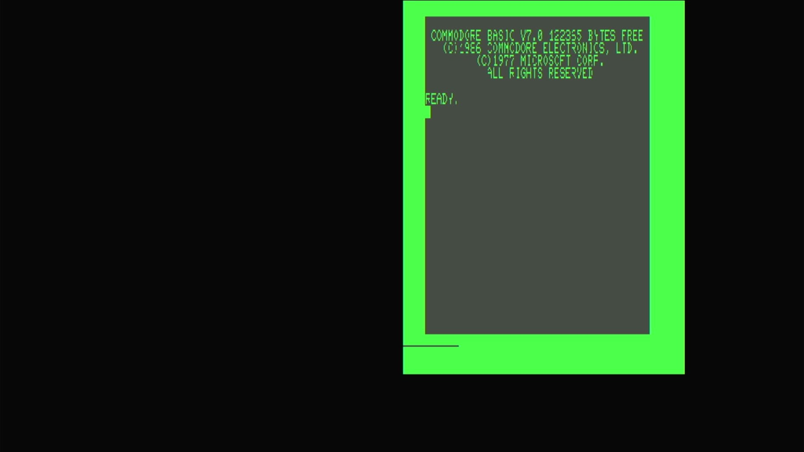

# Commodore 128 (Germany)

- **`make MACHINE=c128_de`** — Commodore Business Machines
- **Year**: 1985
- **Manufacturer**: Commodore Business Machines
- **Television**: PAL

## At power-on

The Commodore 128 (Germany) is the **German-market** revision of the 1985 C128 —
the same machine with a **German character generator** and a **German kernal**.
In MAME this PAL unit (`c128_de`, 1985) is a clone of the base `c128` in the
`src/mame/commodore/c128.cpp` driver family (`c128_state`), distinct from the
`c64.cpp`, `vic20.cpp` and `plus4.cpp` lines already on this appliance. It runs
the **`c128pal` machine config** — the same PAL config the `c128p` root and the
`c128dp` clone use — so what you get is the full C128, localized for Germany.

That is the C128's defining hardware: it carries **two processors** — a **Z80**
(for CP/M) and an **8502** (the 6502-family CPU for 128 and 64 modes) — sharing
one memory map and one kernal ROM complement. It ran a **native 128 mode**
(BASIC 7.0, 128 KB RAM, an 80-column display), a fully **C64-compatible mode**,
and a **CP/M mode**.

This is the **PAL** machine — driven by the **`c128pal` config** — and it fills
the **720x576 PAL canvas**. It boots straight to native 128 mode's sign-on and
`READY.` prompt, here reading **`COMMODORE BASIC V7.0`** with **`122365 BYTES
FREE`**, the `(C)1986 COMMODORE ELECTRONICS, LTD.` / `(C)1977 MICROSOFT CORP.`
copyright block, and `ALL RIGHTS RESERVED`. That `122365 BYTES FREE` — nearly
double the plain C64's `38911` — is the machine's identity: the full 128 KB with
**BASIC 7.0**, a far richer dialect than the C64/VIC-20's BASIC 2.0, with
structured commands, graphics and sound built in.

The C128 is a **dual-display** machine: the **VIC-IIe** drives the 40-column
composite/TV output (shown here, in the same C64-heritage palette) and a
separate **MOS8563 VDC** drives an 80-column RGBI screen. On this appliance both
video chips are instantiated, so the 40-column VIC-IIe screen — the one carrying
the power-on sign-on — renders as one panel on the canvas; the 80-column VDC
surface is idle at BASIC's default 40-column boot. This is the TED-less C128
driver (`src/mame/commodore/c128.cpp`) — none of it comes from `c64.cpp`,
`vic20.cpp` or `plus4.cpp`.

MAME flags this driver `MACHINE_SUPPORTS_SAVE` only (no imperfect-graphics or
imperfect-sound warning), and it boots straight through to BASIC with no warnings
box.

## Required assets

- `roms/c128_de.zip`

  | ROM | CRC32 |
  |---|---|
  | `251913-01.u32` (BASIC lo/hi) | `0010ec31` |
  | `318018-04.u33` (editor/kernal, r4) | `9f9c355b` |
  | `318019-04.u34` (editor/kernal, r4) | `6e2c91a7` |
  | `315078-02.u35` (German kernal, r4) | `b275bb2e` |
  | `315079-01.u18` (German chargen) | `fe5a2db1` |
  | `8721r3.u11` (PLA) | `154db186` |

  Unlike the aliased `c128d` / `c128dp` clones, c128_de is **not** a romset
  alias — it has its own `ROM_START( c128_de )`. Its **German character
  generator** (`315079-01`) and **German kernal** (`315078-02`) are **unique to
  c128_de** and come from the split-set `c128_de.zip`; the **BASIC lo/hi**
  (`251913-01`), the **r4 editor/kernal parts** (`318018-04`, `318019-04`) and
  the **PLA** (`8721r3.u11`) are byte-for-byte the c128 line's, located by
  checksum in the family parent `c128.zip` and repacked. The German U35 kernal
  ships in two variants under an **r2/r4 `ROM_SYSTEM_BIOS` pair**; the driver's
  `ROM_DEFAULT_BIOS("r4")` pins the **r4** member (`315078-02`), and only that
  default is shipped. Every member is located by checksum and repacked under the
  filenames the driver expects.

## Quirks

- **A German 128 — a PAL 128 with localized ROMs.** The German unit swaps the
  character generator and kernal for their German variants; everything else is
  the c128 line. In MAME it is a clone of `c128` driven by the `c128pal` machine
  config, so it is functionally the PAL 128 with a German charset and kernal.
- **Own romset, r4 default of an r2/r4 pair.** Where `c128d`/`c128dp` reuse the
  parent's six-member set verbatim, c128_de has its own `ROM_START` with a German
  chargen and a German kernal carried under an r2/r4 BIOS pair. The appliance
  ships the **r4 default** (`315078-02`); the r2 alternate (`315078-01`) is not
  shipped.
- **A dual-CPU machine.** The C128 carries a **Z80** (for CP/M mode) *and* an
  **8502** (for 128 and C64 modes). They share one memory map and one kernal ROM
  complement, so there is no separate Z80 BIOS romset — the single `c128_de.zip`
  boots all of the machine's modes. Native 128 mode (BASIC 7.0) is what you see
  at power-on.
- **The 8721 PLA is a converted dump.** MAME flags the `8721r3.u11` PLA
  (`154db186`) as a `BAD_DUMP` — it was reconstructed from the chip's reduced
  logic equations rather than read from silicon. It loads and the machine boots
  straight through (MAME notes `8721r3.u11 ROM NEEDS REDUMP` on the serial
  console, no on-screen box); the 128 reaches BASIC 7.0 normally.
- **Two screens, one glass.** The C128's VIC-IIe (40-column) and VDC
  (80-column) are both real hardware. This appliance renders the active
  40-column VIC-IIe screen — the one the boot sign-on writes to; the 80-column
  VDC surface is a second display the native BASIC boot doesn't use.
- **The IEC disk bus boots empty.** The `c128pal` machine config defaults a
  **C1571** drive at device 8 — the 128's native double-sided drive — on the
  external serial bus (`cbm_iec_slot_device::add`, not a built-in-drive
  `config.replace`). That drive's own ROM would be a second romset this
  appliance doesn't need to reach BASIC, so the kernel bakes `-iec8 ""`, exactly
  as the rest of the Commodore line does; a 128 with nothing answering on its
  serial port is a completely valid configuration for reaching BASIC.

[← back to Commodore](README.md)
