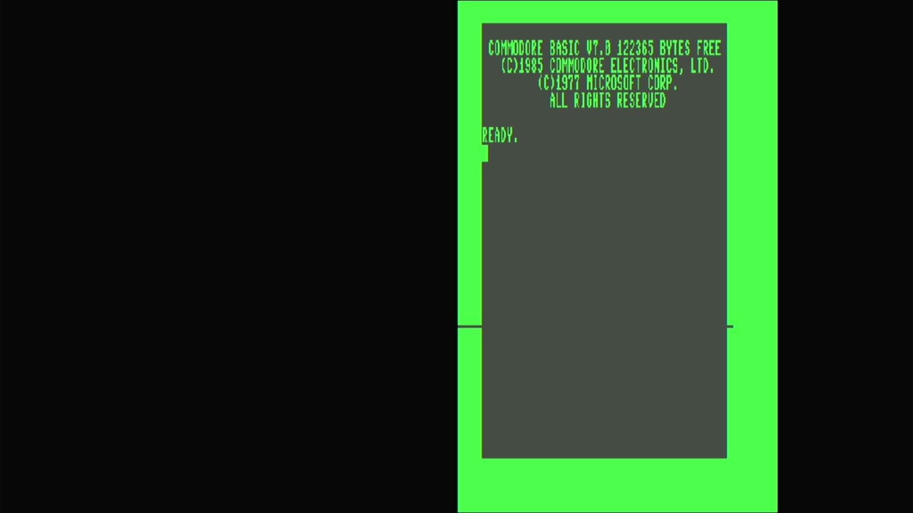

# Commodore 128CR (NTSC, prototype)

- **`make MACHINE=c128cr`** — Commodore Business Machines
- **Year**: 1986
- **Manufacturer**: Commodore Business Machines
- **Television**: NTSC

## At power-on

The Commodore 128CR was the **cost-reduced** revision of the 1985 C128 — the
same machine with a simplified board, its separate BASIC / editor / kernal ROM
parts consolidated into fewer, larger combined ROMs. In MAME this NTSC unit is a
**prototype** (`c128cr`, 1986) — a clone of the base `c128` in the
`src/mame/commodore/c128.cpp` driver family (`c128_state`), distinct from the
`c64.cpp`, `vic20.cpp` and `plus4.cpp` lines already on this appliance. It runs
the base **`c128` machine config** (the same NTSC config the `c128` and `c128d`
use), so what you get is the full C128 on a cost-reduced board.

That is the C128's defining hardware: it carries **two processors** — a **Z80**
(for CP/M) and an **8502** (the 6502-family CPU for 128 and 64 modes) — sharing
one memory map and one kernal ROM complement. It ran a **native 128 mode**
(BASIC 7.0, 128 KB RAM, an 80-column display), a fully **C64-compatible mode**,
and a **CP/M mode**.

This is the **NTSC** machine — driven by the base **`c128` config** — and it
fills the **720x480 NTSC canvas**. It boots straight to native 128 mode's
sign-on and `READY.` prompt, here reading **`COMMODORE BASIC V7.0`** with
**`122365 BYTES FREE`**, the `(C)1985 COMMODORE ELECTRONICS, LTD.` /
`(C)1977 MICROSOFT CORP.` copyright block, and `ALL RIGHTS RESERVED`. That
`122365 BYTES FREE` — nearly double the plain C64's `38911` — is the machine's
identity: the full 128 KB with **BASIC 7.0**, a far richer dialect than the
C64/VIC-20's BASIC 2.0, with structured commands, graphics and sound built in.

The C128 is a **dual-display** machine: the **VIC-IIe** drives the 40-column
composite/TV output (shown here, in the same C64-heritage palette) and a
separate **MOS8563 VDC** drives an 80-column RGBI screen. On this appliance both
video chips are instantiated, so the 40-column VIC-IIe screen — the one carrying
the power-on sign-on — renders as one panel on the canvas; the 80-column VDC
surface is idle at BASIC's default 40-column boot. This is the TED-less C128
driver (`src/mame/commodore/c128.cpp`) — none of it comes from `c64.cpp`,
`vic20.cpp` or `plus4.cpp`.

MAME flags this driver `MACHINE_SUPPORTS_SAVE` only (no imperfect-graphics or
imperfect-sound warning), and it boots straight through to BASIC with no warnings
box.

## Required assets

- `roms/c128cr.zip`

  | ROM | CRC32 |
  |---|---|
  | `252343-03.u34` (combined basic/editor/kernal) | `bc07ed87` |
  | `252343-04.u32` (combined US kernal) | `cc6bdb69` |
  | `390059-01.u18` (chargen) | `6aaaafe6` |
  | `8721r3.u11` (PLA) | `154db186` |

  Unlike the aliased `c128d` / `c128dp` clones, c128cr is **not** a romset
  alias — it has its own `ROM_START( c128cr )`. The cost-reduced board's two
  **combined ROMs** (`252343-03`, `252343-04`) are **unique to c128cr** and come
  from the split-set `c128cr.zip`; the **character generator** (`390059-01`) and
  the **PLA** (`8721r3.u11`) are byte-for-byte the c128 line's, located by
  checksum in the family parent `c128.zip` and repacked. `ROM_START( c128cr )`
  carries **no BIOS revisions** — four plain members, no default-BIOS choice.
  Every member is located by checksum and repacked under the filenames the
  driver expects.

## Quirks

- **A cost-reduced 128 — an NTSC 128 in MAME's model.** The 128CR simplified
  the board and merged the ROMs. In MAME the NTSC prototype (`c128cr`) is a clone
  of `c128` driven by the base `c128` machine config, so it is functionally the
  NTSC 128; only the (unique, combined) ROM layout differs.
- **Two combined ROMs, not aliased.** Where `c128d`/`c128dp` reuse the parent's
  six-member set verbatim, c128cr consolidates BASIC/editor/kernal into
  `252343-03` + `252343-04` — its own romset. It shares only the chargen and PLA
  with the c128 line.
- **A dual-CPU machine.** The C128 carries a **Z80** (for CP/M mode) *and* an
  **8502** (for 128 and C64 modes). They share one memory map and one kernal ROM
  complement, so there is no separate Z80 BIOS romset — the single `c128cr.zip`
  boots all of the machine's modes. Native 128 mode (BASIC 7.0) is what you see
  at power-on.
- **The 8721 PLA is a converted dump.** MAME flags the `8721r3.u11` PLA
  (`154db186`) as a `BAD_DUMP` — it was reconstructed from the chip's reduced
  logic equations rather than read from silicon. It loads and the machine boots
  straight through (MAME notes `8721r3.u11 ROM NEEDS REDUMP` on the serial
  console, no on-screen box); the 128 reaches BASIC 7.0 normally.
- **Two screens, one glass.** The C128's VIC-IIe (40-column) and VDC
  (80-column) are both real hardware. This appliance renders the active
  40-column VIC-IIe screen — the one the boot sign-on writes to; the 80-column
  VDC surface is a second display the native BASIC boot doesn't use.
- **The IEC disk bus boots empty.** The `c128` machine config defaults a
  **C1571** drive at device 8 — the 128's native double-sided drive — on the
  external serial bus (`cbm_iec_slot_device::add`, not a built-in-drive
  `config.replace`). That drive's own ROM would be a second romset this
  appliance doesn't need to reach BASIC, so the kernel bakes `-iec8 ""`, exactly
  as the rest of the Commodore line does; a 128 with nothing answering on its
  serial port is a completely valid configuration for reaching BASIC.

[← back to Commodore](README.md)
