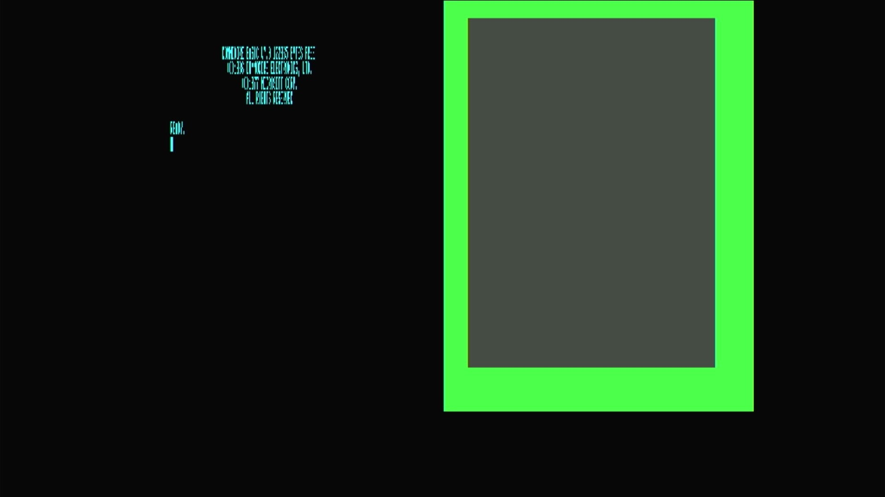

# Commodore 128DCR (PAL)

- **`make MACHINE=c128dcrp`** — Commodore Business Machines
- **Year**: 1987
- **Manufacturer**: Commodore Business Machines
- **Television**: PAL

## At power-on

The Commodore 128DCR was the **cost-reduced 128D** — the desktop C128 with a
built-in drive, on a simplified board whose separate BASIC / editor / kernal ROM
parts were consolidated into fewer, larger combined ROMs. In MAME this PAL unit
(`c128dcrp`, 1987) is a clone of the base `c128` in the
`src/mame/commodore/c128.cpp` driver family (`c128_state`), distinct from the
`c64.cpp`, `vic20.cpp` and `plus4.cpp` lines already on this appliance. It is the
**PAL sibling of `c128dcr`** and runs its **own `c128dcrp` machine config**, the
PAL twin of `c128dcr`'s NTSC config — so what you get is the full C128 on a
cost-reduced board, at PAL timing.

That is the C128's defining hardware: it carries **two processors** — a **Z80**
(for CP/M) and an **8502** (the 6502-family CPU for 128 and 64 modes) — sharing
one memory map and one kernal ROM complement. It ran a **native 128 mode**
(BASIC 7.0, 128 KB RAM, an 80-column display), a fully **C64-compatible mode**,
and a **CP/M mode**.

This is the **PAL** machine — its `c128dcrp` config calls `pal(config)` — and it
fills the **720x576 PAL canvas**. It boots straight to native 128 mode's
sign-on and `READY.` prompt, here reading **`COMMODORE BASIC V7.0`** with
**`122365 BYTES FREE`**, the `(C)1985 COMMODORE ELECTRONICS, LTD.` /
`(C)1977 MICROSOFT CORP.` copyright block, and `ALL RIGHTS RESERVED`. That
`122365 BYTES FREE` — nearly double the plain C64's `38911` — is the machine's
identity: the full 128 KB with **BASIC 7.0**, a far richer dialect than the
C64/VIC-20's BASIC 2.0, with structured commands, graphics and sound built in.

The C128 is a **dual-display** machine: the **VIC-IIe** drives the 40-column
composite/TV output (shown here, in the same C64-heritage palette) and a
separate **MOS8563 VDC** drives an 80-column RGBI screen. On this appliance both
video chips are instantiated, so the 40-column VIC-IIe screen — the one carrying
the power-on sign-on — renders as one panel on the canvas; the 80-column VDC
surface is idle at BASIC's default 40-column boot. This is the TED-less C128
driver (`src/mame/commodore/c128.cpp`) — none of it comes from `c64.cpp`,
`vic20.cpp` or `plus4.cpp`.

MAME flags this driver `MACHINE_SUPPORTS_SAVE` only (no imperfect-graphics or
imperfect-sound warning), and it boots straight through to BASIC with no warnings
box.

## Required assets

- `roms/c128dcrp.zip`

  | ROM | CRC32 |
  |---|---|
  | `318022-02.u34` (combined basic/editor/kernal) | `af1ae1e8` |
  | `318023-02.u32` (combined US kernal) | `eedc120a` |
  | `390059-01.u18` (chargen) | `6aaaafe6` |
  | `8721r3.u11` (PLA) | `154db186` |

  `c128dcrp` is a **`#define` alias** of the DCR romset
  (`rom_c128dcrp == rom_c128dcr`), so its four members are **byte-for-byte**
  `ROM_START( c128dcr )`. Like the `c128cr`/`c128dcr` (and unlike the aliased
  `c128d` / `c128dp`), the DCR set is **not** the plain c128 romset — the
  cost-reduced board's two **combined ROMs** (`318022-02`, `318023-02`) are
  **unique to the DCR** and come from the split-set `c128dcr.zip`; the **character
  generator** (`390059-01`) and the **PLA** (`8721r3.u11`) are byte-for-byte the
  c128 line's, located by checksum in the family parent `c128.zip` and repacked.
  `ROM_START( c128dcr )` carries **no BIOS revisions** — four plain members, no
  default-BIOS choice. Every member is located by checksum and repacked under the
  filenames the driver expects, as `c128dcrp.zip`.

## Quirks

- **A cost-reduced 128D — a PAL 128 in MAME's model.** The 128DCR simplified
  the board and merged the ROMs. In MAME (`c128dcrp`) it is a clone of `c128`
  driven by its own `c128dcrp` machine config (the PAL twin of `c128dcr`'s);
  only the (unique, combined) ROM layout and PAL timing differ.
- **Two combined ROMs, aliased to the NTSC DCR.** Where `c128d`/`c128dp` reuse
  the parent's six-member set verbatim, the DCR consolidates BASIC/editor/kernal
  into `318022-02` + `318023-02` — its own romset, which `c128dcrp` shares
  byte-for-byte with `c128dcr` via `#define rom_c128dcrp rom_c128dcr`. It shares
  only the chargen and PLA with the c128 line.
- **A dual-CPU machine.** The C128 carries a **Z80** (for CP/M mode) *and* an
  **8502** (for 128 and C64 modes). They share one memory map and one kernal ROM
  complement, so there is no separate Z80 BIOS romset — the single `c128dcrp.zip`
  boots all of the machine's modes. Native 128 mode (BASIC 7.0) is what you see
  at power-on.
- **The 8721 PLA is a converted dump.** MAME flags the `8721r3.u11` PLA
  (`154db186`) as a `BAD_DUMP` — it was reconstructed from the chip's reduced
  logic equations rather than read from silicon. It loads and the machine boots
  straight through (MAME notes `8721r3.u11 ROM NEEDS REDUMP` on the serial
  console, no on-screen box); the 128 reaches BASIC 7.0 normally.
- **Two screens, one glass.** The C128's VIC-IIe (40-column) and VDC
  (80-column) are both real hardware. This appliance renders the active
  40-column VIC-IIe screen — the one the boot sign-on writes to; the 80-column
  VDC surface is a second display the native BASIC boot doesn't use.
- **The IEC disk bus boots empty.** The real 128DCR has a built-in 1571CR drive,
  but MAME 0.250's `c128dcrp` config does **not** model it as built-in: it
  defaults a stock **C1571** at device 8 on the external serial bus
  (`cbm_iec_slot_device::add(config, m_iec, "c1571")`, with a `// TODO c1571cr`
  note — the internal `C1571CR` device is offered only in an unused slot
  interface). That is the same emptyable external default the whole flat/D C128
  line uses — not a built-in-drive `config.replace` (the `c128d81`'s `c1563` is
  the only C128 that does that, and it parks on a boot hang). So the kernel bakes
  `-iec8 ""`, exactly as `c128d`/`c128cr`/`c128dcr` do; a 128 with nothing
  answering on its serial port is a completely valid configuration for reaching
  BASIC. No drive-device romset is required or shipped.

[← back to Commodore](README.md)
