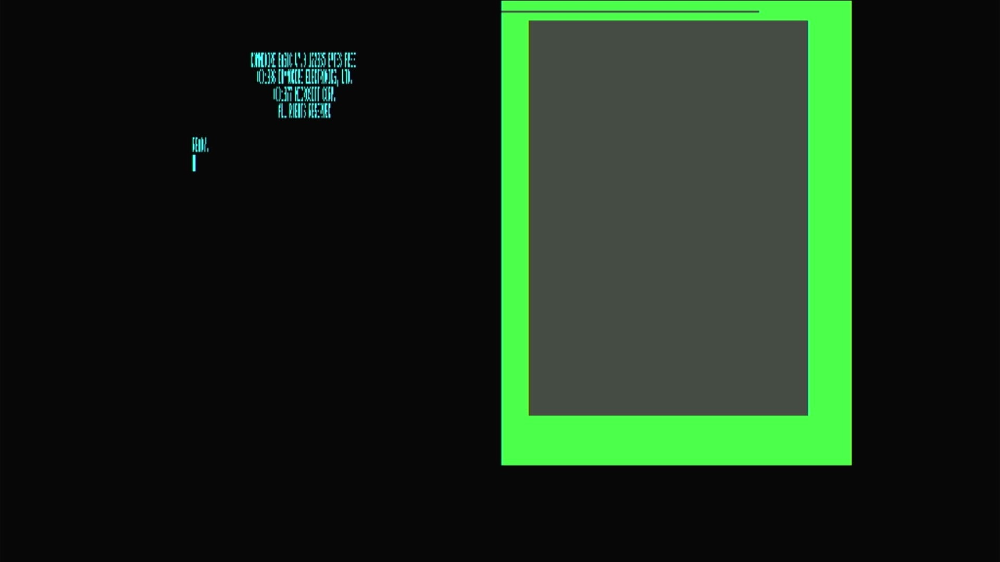

# Commodore 128 (PAL)

- **`make MACHINE=c128p`** — Commodore Business Machines
- **Year**: 1985
- **Manufacturer**: Commodore Business Machines
- **Television**: PAL

## At power-on

The Commodore 128 was Commodore's 1985 successor to the C64 — a **three-in-one**
machine. It ran a **native 128 mode** (BASIC 7.0, 128 KB RAM, an 80-column
display), a fully **C64-compatible mode**, and a **CP/M mode** driven by a
second CPU. That is the C128's defining hardware: it carries **two processors**
— a **Z80** (for CP/M) and an **8502** (the 6502-family CPU for 128 and 64
modes) — sharing one memory map and one kernal ROM complement. In MAME it lives
in the `src/mame/commodore/c128.cpp` driver family (`c128_state`), distinct from
the `c64.cpp`, `vic20.cpp` and `plus4.cpp` lines already on this appliance.

This is the **PAL** machine — driven by the `c128pal` machine config (its NTSC
sibling `c128` uses the base `c128` config) — and it fills the **720x576 PAL
canvas**. It boots straight to native 128 mode's sign-on and `READY.` prompt,
here reading **`COMMODORE BASIC V7.0`** with **`122365 BYTES FREE`**, the
`(C)1986 COMMODORE ELECTRONICS, LTD.` / `(C)1977 MICROSOFT CORP.` copyright
block, and `ALL RIGHTS RESERVED`. That `122365 BYTES FREE` — nearly double the
plain C64's `38911` — is the machine's identity: the full 128 KB with **BASIC
7.0**, a far richer dialect than the C64/VIC-20's BASIC 2.0, with structured
commands, graphics and sound built in.

The C128 is a **dual-display** machine: the **VIC-IIe** drives the 40-column
composite/TV output (shown here, in the same C64-heritage palette) and a
separate **MOS8563 VDC** drives an 80-column RGBI screen. On this appliance both
video chips are instantiated, so the 40-column VIC-IIe screen — the one carrying
the power-on sign-on — renders as one panel on the canvas; the 80-column VDC
surface is idle at BASIC's default 40-column boot. This is the TED-less C128
driver (`src/mame/commodore/c128.cpp`) — none of it comes from `c64.cpp`,
`vic20.cpp` or `plus4.cpp`.

MAME flags this driver `MACHINE_SUPPORTS_SAVE` only (no imperfect-graphics or
imperfect-sound warning), and it boots straight through to BASIC with no warnings
box.

## Required assets

- `roms/c128p.zip`

  | ROM | CRC32 |
  |---|---|
  | `251913-01.u32` (basic/editor) | `0010ec31` |
  | `318018-04.u33` (r4 kernal) | `9f9c355b` |
  | `318019-04.u34` (r4 kernal) | `6e2c91a7` |
  | `318020-05.u35` (r4 kernal) | `ba456b8e` |
  | `390059-01.u18` (chargen) | `6aaaafe6` |
  | `8721r3.u11` (PLA) | `154db186` |

  c128p **shares the c128 family parent's romset** — the driver aliases it
  (`#define rom_c128p rom_c128`), so the members are byte-for-byte the c128 set;
  only the timing and canvas are PAL. `ROM_START( c128 )` offers **four BIOS
  revisions** (`r2`, `r4`, `jiffydos`, `quikslvr`); MAME's `ROM_DEFAULT_BIOS` is
  **`r4`** (Revision 4), and this appliance ships the **default** only. The
  romset is therefore the always-loaded `251913-01` (combined BASIC/editor
  16 KB), the **r4** kernal triple (`318018-04` / `318019-04` / `318020-05`),
  the `390059-01` character generator and the `8721r3.u11` PLA. Every member is
  located by checksum and repacked under the filenames the driver expects.

## Quirks

- **A dual-CPU machine.** The C128 carries a **Z80** (for CP/M mode) *and* an
  **8502** (for 128 and C64 modes). They share one memory map and one kernal ROM
  complement, so there is no separate Z80 BIOS romset — the single `c128p.zip`
  boots all of the machine's modes. Native 128 mode (BASIC 7.0) is what you see
  at power-on.
- **The 8721 PLA is a converted dump.** MAME flags the `8721r3.u11` PLA
  (`154db186`) as a `BAD_DUMP` — it was reconstructed from the chip's reduced
  logic equations rather than read from silicon. It loads and the machine boots
  straight through (MAME notes it on the serial console, no on-screen box); the
  128 reaches BASIC 7.0 normally.
- **Two screens, one glass.** The C128's VIC-IIe (40-column) and VDC
  (80-column) are both real hardware. This appliance renders the active
  40-column VIC-IIe screen — the one the boot sign-on writes to; the 80-column
  VDC surface is a second display the native BASIC boot doesn't use.
- **The IEC disk bus boots empty.** The `c128pal` machine config defaults a
  **C1571** drive at device 8 — the 128's native double-sided drive, not the
  C1541 of the C64/Plus/4 lines. That drive's own ROM would be a second romset
  this appliance doesn't need to reach BASIC, so the kernel bakes `-iec8 ""`,
  exactly as the rest of the Commodore line does; a real C128 with nothing
  plugged into its serial port is a completely valid, common configuration.

[← back to Commodore](README.md)
