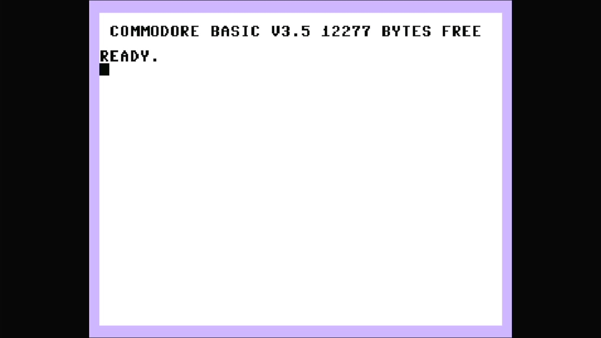

# Commodore 16

- **`make MACHINE=c16`** — Commodore Business Machines
- **Year**: 1984
- **Manufacturer**: Commodore Business Machines
- **Television**: NTSC

## At power-on

The Commodore 16 was Commodore's 1984 budget home computer — the cut-down entry
member of the "264 series" built around the MOS **TED** (7360/8360) chip, which
handles video, sound and I/O in a single part. It shares the Plus/4's 7501/8501
CPU and its `plus4.cpp` driver lineage, but where the Plus/4 shipped 64 KB of
RAM and the built-in 3-PLUS-1 productivity suite, the C16 has just **16 KB of
RAM** and no application ROMs — the machine Commodore aimed at the very bottom
of the market.

This is the NTSC machine. It boots straight to the sign-on and `READY.` prompt,
here reading **`COMMODORE BASIC V3.5`** with **`12277 BYTES FREE`** — and that
byte count is the whole story of the machine. It runs the same **BASIC 3.5** as
the Plus/4 (a substantially richer dialect than the C64/VIC-20's BASIC 2.0, with
graphics, sound and disk commands built in), but with only 16 KB of RAM it frees
just 12277 bytes to the user, against the Plus/4's 60671. There is **no
`3-PLUS-1 ON KEY F1` line** — the C16 has no function ROMs, so the productivity
suite the Plus/4 advertises simply does not exist here.

The glass shows the same **TED pastel palette** as the Plus/4 — a pale lavender
border around a white screen with black text — visually unlike anything else on
this appliance's Commodore platform (the C64's blue-on-blue, the VIC-20's
cyan-and-white). This is the TED/264 driver
(`src/mame/commodore/plus4.cpp`), the same family as the Plus/4 but a distinct
machine (`c16_state`, machine config `c16n`) — none of it comes from `c64.cpp`
or `vic20.cpp`.

MAME flags this driver `MACHINE_SUPPORTS_SAVE` only (no imperfect-graphics or
imperfect-sound warning), and it boots straight through to BASIC with no
warnings box.

## Required assets

- `roms/c16.zip`

  | ROM | CRC32 |
  |---|---|
  | `318005-05.u24` (kernal, rev.5) | `70295038` |
  | `318006-01.u23` (basic) | `74eaae87` |
  | `251641-02.u19` (PLA) | `83be2076` |

  c16 is a clone of the parent `c264` (the Commodore 264 prototype) under MAME's
  split-set convention, and its three members are a **subset** of the Plus/4's:
  the revision-5 kernal (`318005-05.u24`, the `ROM_DEFAULT_BIOS("r5")`
  selection) and the BASIC ROM (`318006-01.u23`) are byte-identical to the
  Plus/4's and packed in `plus4.zip`, while the PLA (`251641-02.u19`) is
  byte-identical to the parent's (CRC `83be2076`) and packed only in `c264.zip`.
  All three are located by checksum and repacked under the exact filenames this
  driver expects. `ROM_START( c16 )` has **no "function" ROM region** — the C16
  omits the Plus/4's 3-PLUS-1 suite entirely, so the two function ROMs
  (`317053-01`, `317054-01`) are absent by design, not missing. The r4 and
  JiffyDOS alternate kernals (optional `ROM_SYSTEM_BIOS` alternates) are not
  required to boot and are not packed.

## Quirks

- **16 KB of RAM, and the sign-on says so.** The `12277 BYTES FREE` on the glass
  is the machine's defining fact — a quarter of the Plus/4's free memory. Any
  BASIC program written here lives inside that 12 KB.
- **No 3-PLUS-1 suite.** Unlike the Plus/4, the C16 has no built-in
  productivity ROMs, which is why the power-on sign-on offers no function-key
  application — the driver's romset carries no "function" region at all.
- **The IEC disk bus boots empty.** The `c16n` machine config nops the ATN
  callback and removes the user port, but keeps the same Commodore serial bus as
  the C64, VIC-20 and Plus/4 lines — a C1541 drive defaulting to device 8, whose
  own ROM would be a second romset this appliance doesn't need to reach BASIC.
  The kernel bakes `-iec8 ""`, exactly as the rest of the Commodore line does; a
  real C16 with nothing plugged into its serial port is a completely valid,
  common configuration.

[← back to Commodore](README.md)
