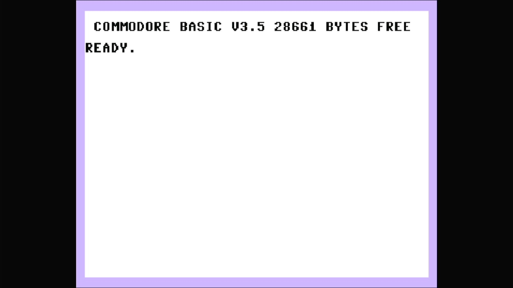

# Commodore 232 (PAL, prototype)

- **`make kernel MACHINE=c232`** — Commodore Business Machines
- **Year**: 1984
- **Manufacturer**: Commodore Business Machines
- **Television**: PAL

## At power-on

The Commodore 232 was a **pre-production prototype** in Commodore's 1984 "264
series" — the same TED-based family as the Plus/4 and the C16, built around the
MOS **TED** (7360/8360) chip that handles video, sound and I/O in one part. It
was never a shipping product: it sat between the 16 KB C16 and the 64 KB Plus/4
with **32 KB of RAM** and, like the C16, none of the Plus/4's built-in 3-PLUS-1
productivity ROMs. In MAME it lives in `src/mame/commodore/plus4.cpp` as a clone
of the `c264` prototype parent (`c16_state`, machine config `c232` — which is
literally the PAL C16's config with the RAM default raised to 32K).

This is the **PAL** machine — its MAME config chain is
`c232` → `c16p` → `plus4p`, so it inherits the PAL dot clock and fills the wider
**720x576 PAL canvas**. It boots straight to the sign-on and `READY.` prompt,
here reading **`COMMODORE BASIC V3.5`** with **`28661 BYTES FREE`** — and that
byte count is the machine's whole identity. It runs the same **BASIC 3.5** as
the Plus/4 and C16 (a substantially richer dialect than the C64/VIC-20's BASIC
2.0, with graphics, sound and disk commands built in), but its 32 KB of RAM sits
squarely between the C16's `12277 BYTES FREE` and the Plus/4's `60671` — the
prototype's defining "middle" configuration. There is **no `3-PLUS-1 ON KEY F1`
line**: like the C16, the 232 has no function ROMs, so the productivity suite
the Plus/4 advertises simply does not exist here.

The glass shows the same **TED pastel palette** as the rest of the 264 line — a
pale lavender border around a white screen with black text — visually unlike
anything else on this appliance's Commodore platform (the C64's blue-on-blue,
the VIC-20's cyan-and-white). This is the TED/264 driver
(`src/mame/commodore/plus4.cpp`), the same family as the Plus/4 but a distinct
machine (`c16_state`, machine config `c232`) — none of it comes from `c64.cpp`
or `vic20.cpp`.

MAME flags this driver `MACHINE_SUPPORTS_SAVE` only (no imperfect-graphics or
imperfect-sound warning), and it boots straight through to BASIC with no
warnings box.

## Required assets

- `roms/c232.zip`

  | ROM | CRC32 |
  |---|---|
  | `318004-01.u5` (kernal) | `dbdc3319` |
  | `318006-01.u4` (basic) | `74eaae87` |
  | `251641-02.u7` (PLA) | `83be2076` |

  c232 is a clone of the parent `c264` (the Commodore 264 prototype) under MAME's
  split-set convention. Its kernal **`318004-01.u5` (`dbdc3319`) is unique to the
  232** — it appears in no other machine on this appliance — and, with the shared
  basic (`318006-01.u4`, byte-identical to the rest of the 264 line), is packed
  under the exact `ROM_START( c232 )` names in the split-set clone zip `c232.zip`.
  The PLA (`251641-02.u7`) is byte-identical to the parent's (CRC `83be2076`) and
  merges from `c264.zip`. All three are located by checksum and repacked under the
  filenames this driver expects. `ROM_START( c232 )` has **no "function" ROM
  region** — the 232 omits the Plus/4's 3-PLUS-1 suite entirely, so the two
  function ROMs (`317053-01`, `317054-01`) are absent by design, not missing.

## Quirks

- **32 KB of RAM — the prototype's "middle" configuration.** The `28661 BYTES
  FREE` on the glass is the machine's defining fact: more than double the C16's
  12277, less than half the Plus/4's 60671. Any BASIC program written here lives
  inside that 32 KB.
- **No 3-PLUS-1 suite.** Like the C16, the 232 has no built-in productivity
  ROMs, which is why the power-on sign-on offers no function-key application —
  the driver's romset carries no "function" region at all.
- **A prototype, not a product.** The 232 never shipped; it survives only as a
  MAME driver clone of the `c264` prototype parent. The unique `318004-01` kernal
  is the one artefact that distinguishes it from its siblings.
- **The IEC disk bus boots empty.** The `c232` machine config keeps the same
  Commodore serial bus as the C64, VIC-20 and Plus/4 lines — a C1541 drive
  defaulting to device 8, whose own ROM would be a second romset this appliance
  doesn't need to reach BASIC. The kernel bakes `-iec8 ""`, exactly as the rest
  of the Commodore line does; a real 232 with nothing plugged into its serial
  port is a completely valid, common configuration.

[← back to Commodore](README.md)
