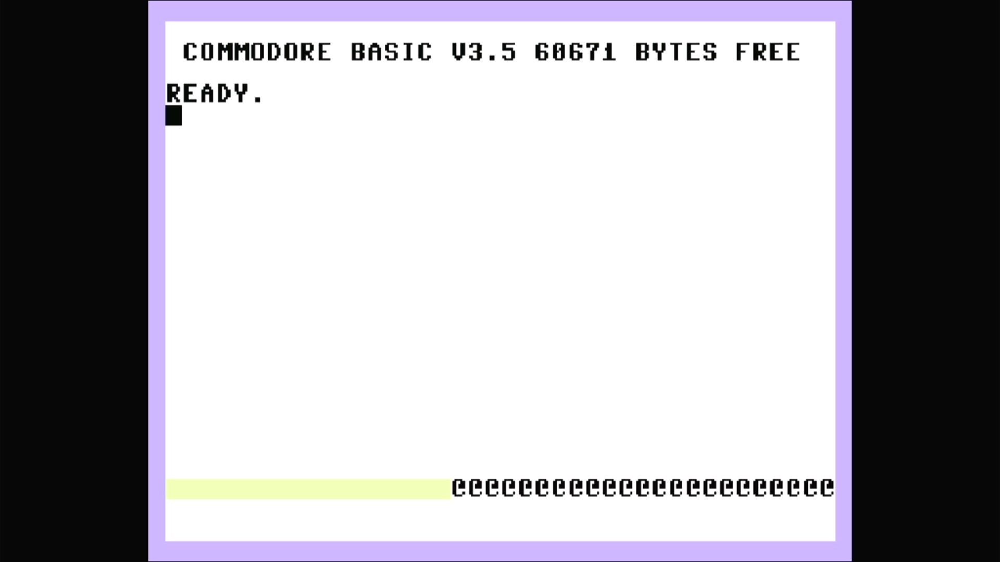

# Commodore 264

- **`make kernel MACHINE=c264`** — Commodore Business Machines
- **Year**: 1984
- **Manufacturer**: Commodore Business Machines
- **Television**: NTSC

## At power-on

The Commodore 264 is the **pre-production prototype** at the head of Commodore's
1984 "264 series" — the driver *parent* that the Plus/4, C16, C116, C232 and
V364 all descend from (`src/mame/commodore/plus4.cpp`, `plus4_state`, machine
config `plus4n`). Like the whole family it is built around the MOS **TED**
(7360/8360) chip, which folds video, sound and I/O into a single part, driving a
7501/8501 CPU. The 264 carries 64 KB of RAM but — unlike the production Plus/4 —
**no built-in 3-PLUS-1 productivity suite**: on the prototype the "function" ROM
region is empty (`ROMREGION_ERASE00`, the cartridge-slot EPROMs unpopulated), so
there is no `3-PLUS-1 ON KEY F1` line on the sign-on.

This is the NTSC machine. It boots straight to the TED character generator's
sign-on and `READY.` prompt, reading **`COMMODORE BASIC V3.5`** with **`60671
BYTES FREE`** — the full-64 KB free figure it shares with the Plus/4 (and far
above the 16 KB C16/C116's 12277). The 264 runs **BASIC 3.5**, the richer
dialect with graphics, sound and disk commands built in, unlike the C64/VIC-20's
BASIC 2.0. The glass shows the family's own **TED pastel palette** — a pale
lavender border around a white screen with black text — the same look as the
Plus/4, distinct from the C64's blue-on-blue.

The 264 carries its own unique 264-series firmware (`basic-264.bin`,
`kernal-264.bin`) rather than the production Plus/4's `318006`/`318005` parts —
this is prototype BASIC/kernal, not the shipped revision.

## Imperfect graphics

The 264 is the **only machine in the TED/264 family MAME flags
`MACHINE_IMPERFECT_GRAPHICS`** (the rest carry `MACHINE_SUPPORTS_SAVE` only).
On this appliance the flag does **not** raise a blocking "known problems" box —
the machine boots straight through to BASIC (bench-proven on a real Pi 4). What
it does produce is a visible rendering defect at the **very bottom of the
screen**: a short pale-yellow bar on the left and a run of repeated glyph
characters on the right, occupying the last scan-row *below* the BASIC text
area. It is stable (byte-identical across grabs ~15 s apart) and does not touch
the sign-on, the `READY.` prompt or the cursor — the machine is fully usable;
the imperfection is cosmetic, confined to that bottom strip. This is the
observed manifestation of the driver's imperfect-graphics flag on the prototype.

## Required assets

- `roms/c264.zip`

  | ROM | CRC32 |
  |---|---|
  | `basic-264.bin` (BASIC) | `6a2fc8e3` |
  | `kernal-264.bin` (kernal) | `8f32abe7` |
  | `251641-02` (PLA) | `83be2076` |

  c264 is the driver **parent**, so under MAME's split-set convention its zip is
  self-contained — all three members live in `c264.zip` under their exact
  `ROM_START` names, located by checksum. There are no `ROM_SYSTEM_BIOS`
  alternates: the prototype romset is a single fixed set. The `251641-02` PLA
  here is the shared member the Plus/4, C16 and C116 romsets borrow back from
  this parent.

## Quirks

- **No 3-PLUS-1 suite.** Unlike the production Plus/4, the prototype's function
  ROM region is unpopulated (`ROMREGION_ERASE00`) — no word-processor /
  spreadsheet / database / graphing firmware, and so no `3-PLUS-1 ON KEY F1`
  offer on the sign-on.
- **The IEC disk bus boots empty.** The 264 wires the same Commodore serial bus
  as the C64 and VIC-20 lines — a C1541 drive defaulting to device 8, whose own
  ROM would be a second romset not needed to reach BASIC. The kernel bakes
  `-iec8 ""`, exactly as the rest of the Commodore line does; a real 264 with
  nothing plugged into its serial port is a valid, common configuration.

[← back to Commodore](README.md)
