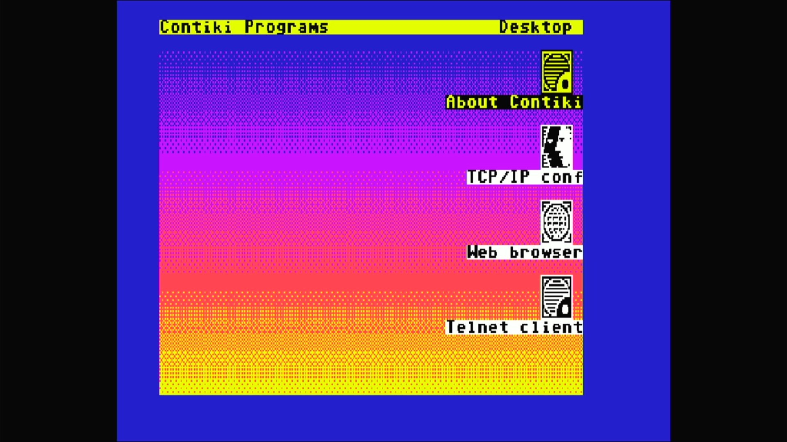

# Commodore 64 (NTSC)

- **`make MACHINE=c64`** — Commodore Business Machines
- **Year**: 1982
- **Manufacturer**: Commodore Business Machines
- **Television**: NTSC

## At power-on

Commodore 64 BASIC V2, `READY.` — the IEC disk bus boots empty (`-iec8
""`), so no drive romset is required to reach BASIC.

## Required assets

- `roms/c64.zip`

  | ROM | CRC32 |
  |---|---|
  | `901226-01.u3` (basic) | `f833d117` |
  | `901227-03.u4` (kernal r3) | `dbe3e7c7` |
  | `901225-01.u5` (chargen) | `ec4272ee` |
  | `906114-01.u17` (PLA) | `54c89351` |

## Booting media

This is not stock C64 software: Contiki 1.0 (Adam Dunkels, BSD-licensed)
is a modern, open-source, graphical desktop operating system — windows,
a web browser, TCP/IP networking and a Telnet client — that happens to
run on a 64 KB C64. It loads from a `.d64` floppy image over the IEC bus
like any other program; nothing about the machine or its ROMs changes to
support it.

[← back to Commodore](README.md)
