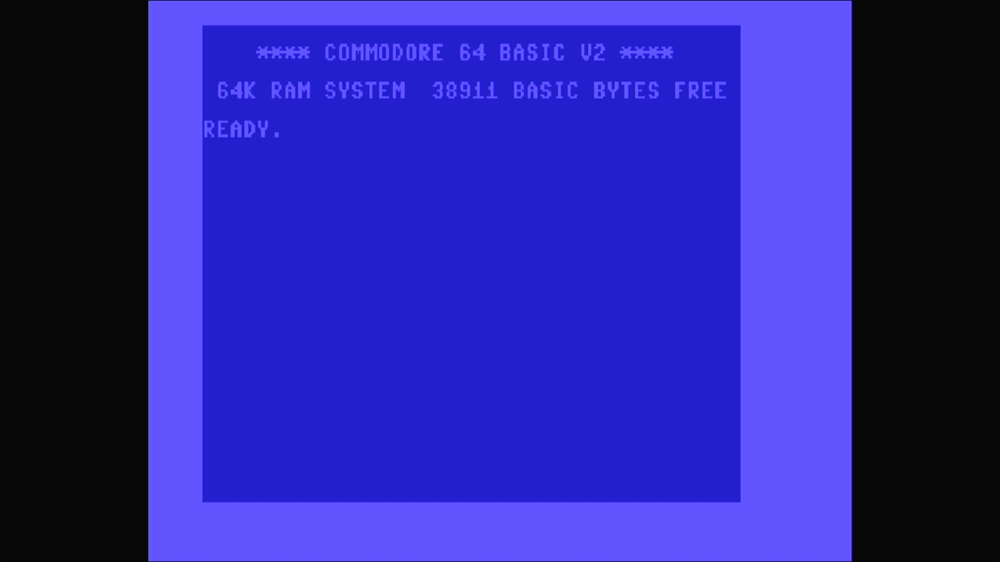
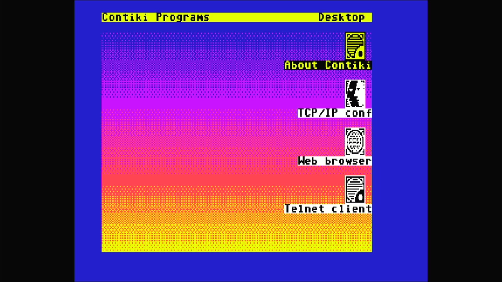

# Commodore 64 (NTSC)

- **`make kernel MACHINE=c64`** — Commodore
- **Year**: 1982
- **Manufacturer**: Commodore Business Machines
- **Television**: NTSC

## At power-on

Commodore 64 BASIC V2, `READY.` — the IEC disk bus boots empty (`-iec8 ""`), so no drive romset is required to reach BASIC.

## Required assets

- `roms/c64.zip`

  | ROM | CRC32 |
  |---|---|
  | `901226-01.u3` | `f833d117` |
  | `901227-01.u4` | `dce782fa` |
  | `901227-02.u4` | `a5c687b3` |
  | `901227-03.u4` | `dbe3e7c7` |
  | `jiffydos c64.u4` | `2f79984c` |
  | `speed-dos.u4` | `5beb9ac8` |
  | `speed-dosplus.u4` | `10aee0ae` |
  | `speed-dosplus27.u4` | `ff59995e` |
  | `prodos.u4` | `37ed83a2` |
  | `prodos24l2.u4` | `41dad9fe` |
  | `prodos35l2.u4` | `2822eee7` |
  | `turborom.u4` | `e6c763a2` |
  | `dosrom12.u4` | `ac030fc0` |
  | `turborom2.u4` | `ea3ba683` |
  | `mercury3.u4` | `6eac46a2` |
  | `kernal-10-mager.u4` | `c9bb21bc` |
  | `kernal-20-1_au.u4` | `7068bbcc` |
  | `kernal-20-1.u4` | `c9c4c44e` |
  | `kernal-20-2.u4` | `ffaeb9bc` |
  | `kernal-20-3.u4` | `4fd511f2` |
  | `kernal-30.u4` | `5402d643` |
  | `turboaccess26.u4` | `93de6cd9` |
  | `turboaccess301.u4` | `b3304dcf` |
  | `turboaccess302.u4` | `9e696a7b` |
  | `turboprocess.u4` | `e5610d76` |
  | `turboprocessus.u4` | `7480b76a` |
  | `exos3.u4` | `4e54d020` |
  | `exos4.u4` | `d5cf83a9` |
  | `digidos.u4` | `2b0c8e89` |
  | `magnum.u4` | `b2cffcc6` |
  | `mercury31s.u4` | `97aa5d2f` |
  | `901225-01.u5` | `ec4272ee` |
  | `906114-01.u17` | `54c89351` |

## Notes

- MAME driver: `c64.cpp`.

## Booting media

This is not stock C64 software: Contiki 1.0 (Adam Dunkels, BSD-licensed)
is a modern, open-source, graphical desktop operating system — windows,
a web browser, TCP/IP networking and a Telnet client — that happens to
run on a 64 KB C64. It loads from a `.d64` floppy image over the IEC bus
like any other program; nothing about the machine or its ROMs changes to
support it.

[← back to Commodore](README.md)
