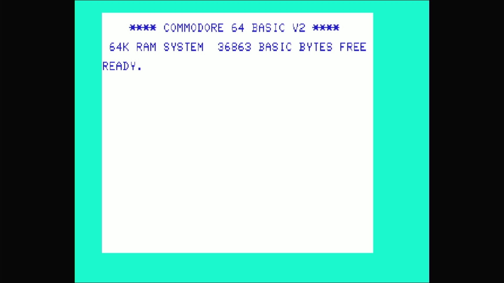

# Commodore 64 (Japan)

- **`make MACHINE=c64_jp`** — Commodore Business Machines
- **Year**: 1982
- **Manufacturer**: Commodore Business Machines
- **Television**: NTSC

## At power-on

Commodore 64 BASIC V2, `READY.` — the IEC disk bus boots empty (`-iec8
""`), so no drive romset is required to reach BASIC. The Japanese machine
carries its own kernal and character generator, so its power-on colours
and free-memory figure differ from the standard c64 (`36863 BASIC BYTES
FREE`); the sign-on banner is the same shape.

## Required assets

- `roms/c64_jp.zip`

  | ROM | CRC32 |
  |---|---|
  | `901226-01.u3` (basic) | `f833d117` |
  | `906145-02.u4` (kernal) | `3a9ef6f1` |
  | `906143-02.u5` (chargen) | `1604f6c1` |
  | `906114-01.u17` (PLA) | `54c89351` |

  A distinct romset — not a `#define` alias of `rom_c64`. The Japanese
  kernal (`906145-02.u4`) and chargen (`906143-02.u5`) are unique to this
  machine; the basic and PLA are byte-identical to the NTSC `c64`.

[← back to Commodore](README.md)
