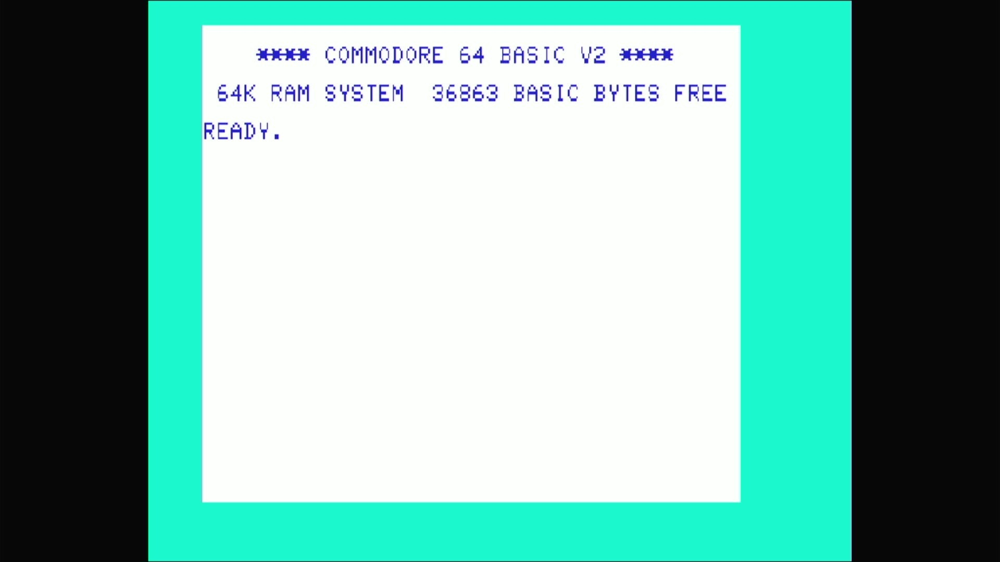

# Commodore 64 (Japan)

- **`make kernel MACHINE=c64_jp`** — Commodore
- **Year**: 1982
- **Manufacturer**: Commodore Business Machines
- **Television**: NTSC

## At power-on

Commodore 64 BASIC V2, `READY.` — the IEC disk bus boots empty (`-iec8 ""`), so no drive romset is required to reach BASIC. The Japanese machine carries its own kernal and character generator, so its power-on colours and free-memory figure differ from the standard c64 (`36863 BASIC BYTES FREE`); the sign-on banner is the same shape.

## Required assets

- `roms/c64_jp.zip`

  | ROM | CRC32 |
  |---|---|
  | `901226-01.u3` (basic) | `f833d117` |
  | `906145-02.u4` (kernal) | `3a9ef6f1` |
  | `906143-02.u5` (chargen) | `1604f6c1` |
  | `906114-01.u17` | `54c89351` |

## Notes

- MAME driver: `c64.cpp`.
- MAME clone of `c64` (Commodore 64 (NTSC)) — the system macro's parent field in the driver source. The ROM table above lists every member this machine's own zip needs.

[← back to Commodore](README.md)
