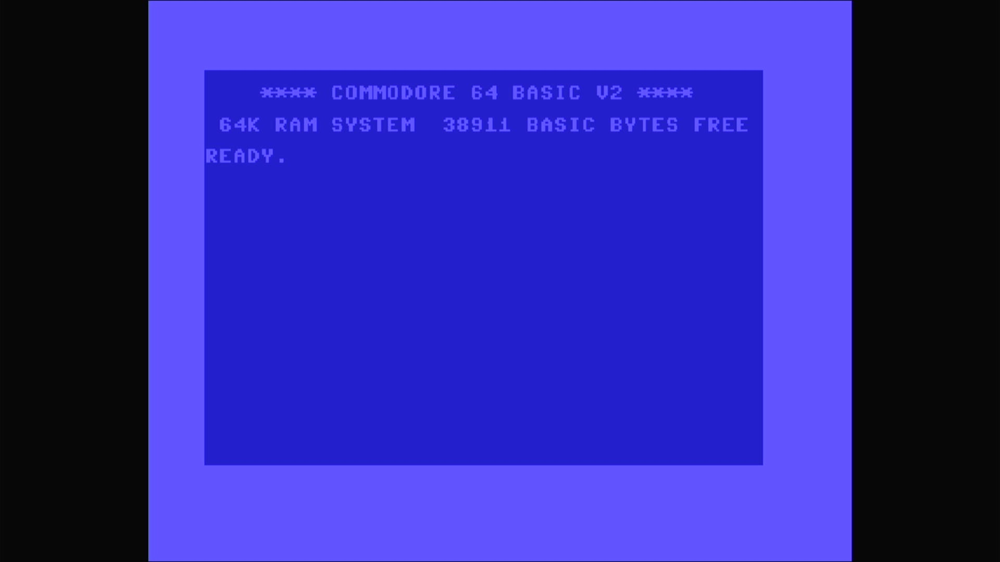

# Commodore 64C (Spain)

- **`make kernel MACHINE=c64c_es`** — Commodore
- **Year**: 1988
- **Manufacturer**: Commodore Business Machines
- **Television**: PAL

## At power-on

Commodore 64 BASIC V2, `READY.` — the IEC disk bus boots empty (`-iec8 ""`), so no drive romset is required to reach BASIC. The Spanish 64C is a distinct romset carrying its own character generator (`325056-03.u5`, aka `325245-01`); the sign-on banner and free-memory figure match the 64C, and the Spanish glyphs live in the chargen, which the sign-on text does not exercise. Like every 64C it merges BASIC and the KERNAL into a single 16 KB part (`251913-01.u4`).

## Required assets

- `roms/c64c_es.zip`

  | ROM | CRC32 |
  |---|---|
  | `251913-01.u4` | `0010ec31` |
  | `325056-03.u5` | `c890c175` |
  | `252715-01.u8` | `54c89351` |

## Notes

- MAME driver: `c64.cpp`.
- MAME clone of `c64` (Commodore 64 (NTSC)) — the system macro's parent field in the driver source. The ROM table above lists every member this machine's own zip needs.

[← back to Commodore](README.md)
