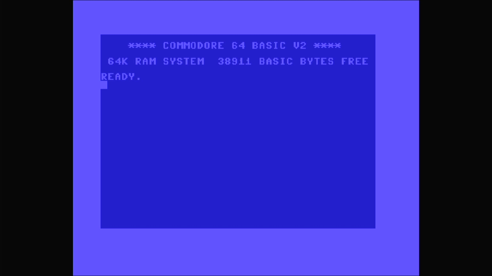

# Commodore 64C (Sweden/Finland)

- **`make kernel MACHINE=c64c_se`** — Commodore Business Machines
- **Year**: 1986
- **Manufacturer**: Commodore Business Machines
- **Television**: PAL

## At power-on

Commodore 64 BASIC V2, `READY.` — the IEC disk bus boots empty (`-iec8
""`), so no drive romset is required to reach BASIC. The Swedish/Finnish
64C is a distinct romset carrying its own KERNAL (`325182-01.u4`, the
"128/64 FI" part) and its own Scandinavian character generator
(`cbm 64 skand.gen.u5`). Both are unique to this machine — unlike the
Spanish `c64c_es`, it does not share the combined BASIC+KERNAL part with
the `c64c`. The sign-on banner and free-memory figure match the 64C; the
Scandinavian glyphs live in the chargen, which the sign-on text does not
exercise.

## Required assets

- `roms/c64c_se.zip`

  | ROM | CRC32 |
  |---|---|
  | `325182-01.u4` (kernal FI) | `2aff27d3` |
  | `cbm 64 skand.gen.u5` (chargen SE) | `377a382b` |
  | `252715-01.u8` (PLA) | `54c89351` |

  A distinct romset — not a `#define` alias of `rom_c64c`. Both the
  Swedish/Finnish KERNAL (`325182-01.u4`) and the Scandinavian character
  generator (`cbm 64 skand.gen.u5`) are unique to this machine and come
  from its own split-set zip; the chargen member name contains spaces.
  The PLA content is the standard C64 PLA (identical to `c64`'s
  `906114-01.u17`), which the driver expects here under the `252715-01.u8`
  filename. The PLA dump is flagged `BAD_DUMP` upstream (MAME warns
  `ROM NEEDS REDUMP` on the serial console); it loads and boots normally.

[← back to Commodore](README.md)
