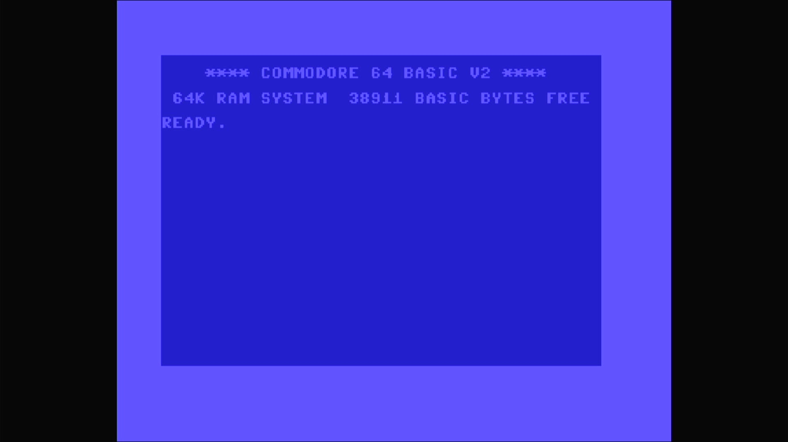

# Commodore 64G (PAL)

- **`make kernel MACHINE=c64g`** — Commodore Business Machines
- **Year**: 1986
- **Manufacturer**: Commodore Business Machines
- **Television**: PAL

## At power-on

Commodore 64 BASIC V2, `READY.` — the IEC disk bus boots empty (`-iec8
""`), so no drive romset is required to reach BASIC. The `c64g` is the PAL
64G, the later breadbin-cased machine built on the cost-reduced 64C
internals — differing from the `c64c` only in video/CIA timing (PAL vs.
NTSC), which is machine config, not ROM data. Its sign-on banner and
free-memory figure match the 64C. The visible difference is inside the
case, not on the screen: the 64C/64G merge BASIC and the KERNAL into a
single 16 KB part.

## Required assets

- `roms/c64g.zip`

  | ROM | CRC32 |
  |---|---|
  | `251913-01.u4` (basic+kernal) | `0010ec31` |
  | `901225-01.u5` (chargen) | `ec4272ee` |
  | `252715-01.u8` (PLA) | `54c89351` |

  A `#define` alias of `rom_c64c` — the romset is byte-identical to the
  64C's three members (only the timing is PAL). The 64C/64G's defining
  part is the combined `251913-01.u4`, a single 16 KB ROM holding both
  BASIC and the KERNAL (the original `c64` keeps them in two 8 KB parts).
  The chargen is byte-identical to the `c64`; the PLA content is the
  standard C64 PLA (identical to `c64`'s `906114-01.u17`), which the driver
  expects here under the `252715-01.u8` filename. Under that filename the
  PLA dump is flagged `BAD_DUMP` upstream (MAME warns `ROM NEEDS REDUMP` on
  the serial console); it loads and boots normally. The kernal region has
  BIOS choices — the default `cbm` (Original) is baked; the alternate `pdc`
  (ProLogic-DOS Classic) is not shipped.

[← back to Commodore](README.md)
