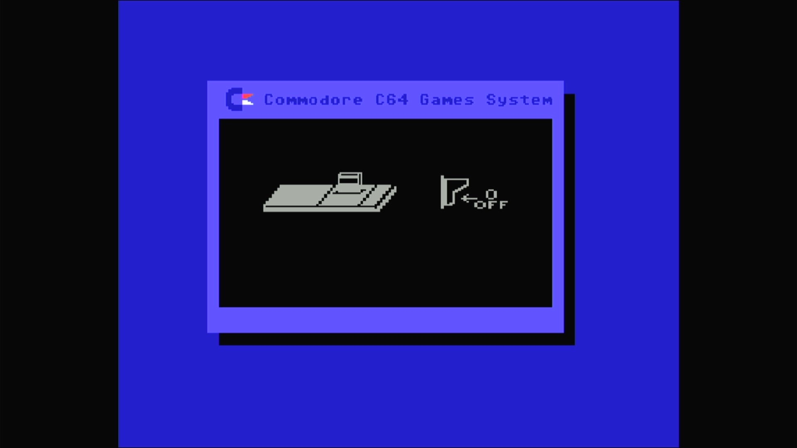

# Commodore 64 Games System

- **`make kernel MACHINE=c64gs`** — Commodore Business Machines
- **Year**: 1990
- **Manufacturer**: Commodore Business Machines
- **Television**: PAL

## At power-on

The C64GS is the keyboard-less, cartridge-only console built on Commodore
64C internals. With no cartridge inserted it runs its own boot ROM, which
draws the built-in **"insert cartridge"** animation — the `Commodore C64
Games System` title bar, a cartridge sliding into the slot, the power
switch, and a red cross. **This is the console's correct power-on state,
not a fault**: a real C64GS with an empty slot shows exactly this screen
(the same way the Amstrad GX4000 halts at its own cart-less sign-on). The
appliance bakes no cartridge, so the animation is what the glass shows.

The C64GS carries its own unique KERNAL (`390852-01.u4`) — the GS boot ROM
that produces this animation — and shares its character generator and PLA
with the rest of the 64C line by checksum. The cartridge slot is **not**
mandatory in the driver (`pal_gs` sets no `set_must_be_loaded`), so the
machine boots straight to its animation with no blocking file manager.

## Required assets

- `roms/c64gs.zip`

  | ROM | CRC32 |
  |---|---|
  | `390852-01.u4` (kernal GS) | `b0a9c2da` |
  | `901225-01.u5` (chargen) | `ec4272ee` |
  | `252535-01.u8` (PLA) | `54c89351` |

  A distinct romset — not a `#define` alias. The GS KERNAL
  (`390852-01.u4`) is unique to this console and comes from its own
  split-set zip. The character generator (`901225-01.u5`) is the standard
  C64/C64C chargen, and the PLA content is the standard C64 PLA (identical
  to `c64`'s `906114-01.u17`), which the driver expects here under the
  `252535-01.u8` filename. The PLA dump is flagged `BAD_DUMP` upstream
  (MAME warns `ROM NEEDS REDUMP` on the serial console); it loads and
  boots normally.

[← back to Commodore](README.md)
