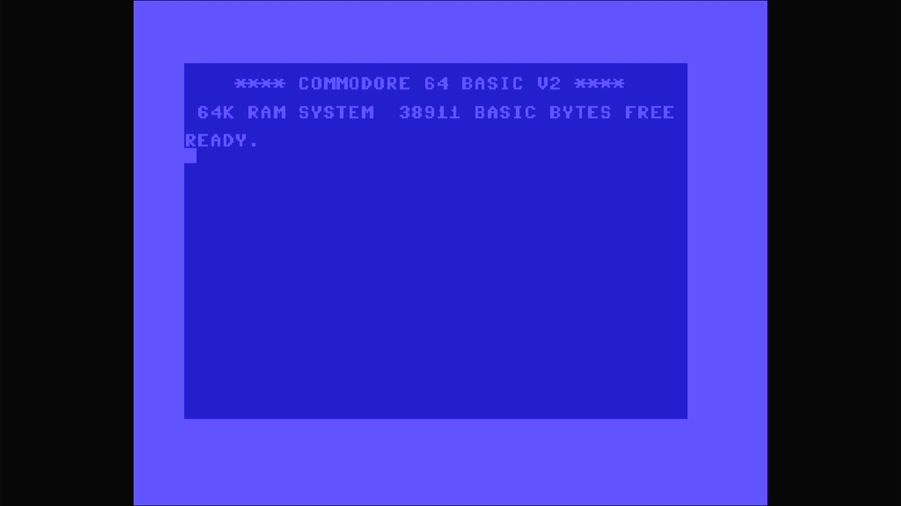

# Commodore 64 (PAL)

- **`make kernel MACHINE=c64p`** — Commodore
- **Year**: 1982
- **Manufacturer**: Commodore Business Machines
- **Television**: PAL

## At power-on

Commodore 64 BASIC V2, `READY.` — the IEC disk bus boots empty (`-iec8 ""`), so no drive romset is required to reach BASIC. Same BASIC as the NTSC c64; only the video/CIA timing is PAL.

## Required assets

- `roms/c64p.zip`

  | ROM | CRC32 |
  |---|---|
  | `901226-01.u3` (basic) | `f833d117` |
  | `901227-01.u4` (kernal) | `dce782fa` |
  | `901227-02.u4` (kernal) | `a5c687b3` |
  | `901227-03.u4` (kernal) | `dbe3e7c7` |
  | `jiffydos c64.u4` (kernal) | `2f79984c` |
  | `speed-dos.u4` (kernal) | `5beb9ac8` |
  | `speed-dosplus.u4` (kernal) | `10aee0ae` |
  | `speed-dosplus27.u4` (kernal) | `ff59995e` |
  | `prodos.u4` (kernal) | `37ed83a2` |
  | `prodos24l2.u4` (kernal) | `41dad9fe` |
  | `prodos35l2.u4` (kernal) | `2822eee7` |
  | `turborom.u4` (kernal) | `e6c763a2` |
  | `dosrom12.u4` (kernal) | `ac030fc0` |
  | `turborom2.u4` (kernal) | `ea3ba683` |
  | `mercury3.u4` (kernal) | `6eac46a2` |
  | `kernal-10-mager.u4` (kernal) | `c9bb21bc` |
  | `kernal-20-1_au.u4` (kernal) | `7068bbcc` |
  | `kernal-20-1.u4` (kernal) | `c9c4c44e` |
  | `kernal-20-2.u4` (kernal) | `ffaeb9bc` |
  | `kernal-20-3.u4` (kernal) | `4fd511f2` |
  | `kernal-30.u4` (kernal) | `5402d643` |
  | `turboaccess26.u4` (kernal) | `93de6cd9` |
  | `turboaccess301.u4` (kernal) | `b3304dcf` |
  | `turboaccess302.u4` (kernal) | `9e696a7b` |
  | `turboprocess.u4` (kernal) | `e5610d76` |
  | `turboprocessus.u4` (kernal) | `7480b76a` |
  | `exos3.u4` (kernal) | `4e54d020` |
  | `exos4.u4` (kernal) | `d5cf83a9` |
  | `digidos.u4` (kernal) | `2b0c8e89` |
  | `magnum.u4` (kernal) | `b2cffcc6` |
  | `mercury31s.u4` (kernal) | `97aa5d2f` |
  | `901225-01.u5` (chargen) | `ec4272ee` |
  | `906114-01.u17` | `54c89351` |

## Notes

- MAME driver: `c64.cpp`.
- MAME clone of `c64` (Commodore 64 (NTSC)) — the system macro's parent field in the driver source. The ROM table above lists every member this machine's own zip needs.

[← back to Commodore](README.md)
