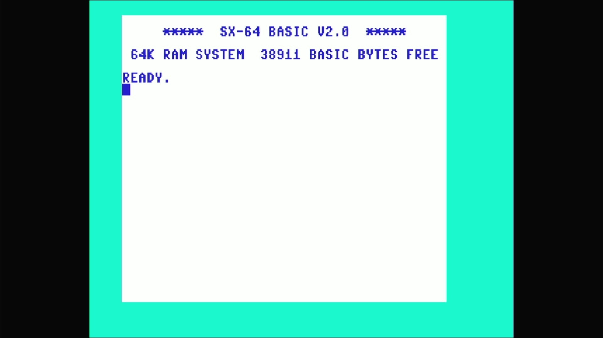

# DX-64 (NTSC)



- **`make MACHINE=dx64`** — Commodore Business Machines
- **Year**: 1984
- **Manufacturer**: Commodore Business Machines
- **Television**: NTSC

## At power-on

The DX-64 is the **twin-drive prototype** of the SX-64 — the same portable,
luggable C64, but with a *second* built-in 5.25" 1541 fitted where the SX-64
has a keyboard-well storage slot. It runs the SX-64's own KERNAL, so it draws
the same **distinct sign-on**: `***** SX-64 BASIC V2.0 *****`, `64K RAM
SYSTEM  38911 BASIC BYTES FREE`, `READY.` — the SX kernal's inverted colour
scheme, dark-blue text on a white screen (the breadbin's light-blue-on-dark-
blue is reversed), which is the appliance's proof this is the SX romset and
not a plain c64.

## The two built-in drives

Where the SX-64's `ntsc_sx` config replaces the **iec8** slot's default with
the built-in `sx1541`, the DX-64's `ntsc_dx` config **builds on `ntsc_sx`**
and adds a *second* built-in drive on the **iec9** slot:

```
void sx64_state::ntsc_dx(machine_config &config)
{
    ntsc_sx(config);                                              // iec8 sx1541
    CBM_IEC_SLOT(config.replace(), "iec9", 9, sx1541_iec_devices, "sx1541");
}
```

So the DX-64 carries drives on **both** device 8 and device 9. Both are
**built-in hardware**, and built-in hardware is never removed: the appliance
ships the machine as the driver defines it, with no `-iec8`/`-iec9` override.
MAME's twin `sx1541` defaults stand, so the machine requires the `sx1541`
drive romset (one romset serves both drives) and boots to the SX kernal's own
sign-on **with both internal drives present**. (The C64-line `-iec8 ""` bake
applies only to machines whose device-8 default models an *external*, plug-in
drive — never to a built-in one.) On the real Pi 4, `dx64` boots cleanly with
both drives initialised and no missing-ROM fatal.

## Required assets

- `roms/dx64.zip`

  | ROM | CRC32 |
  |---|---|
  | `901226-01.ud4` (basic) | `f833d117` |
  | `251104-04.ud3` (kernal SX) | `2c5965d4` |
  | `901225-01.ud1` (chargen) | `ec4272ee` |
  | `906114-01.ue4` (PLA) | `54c89351` |

  A `#define` alias — `rom_dx64 == rom_sx64` in `c64.cpp`, so the romset is
  byte-identical to the NTSC `sx64`'s four members; only the machine config
  differs (the second built-in drive on iec9), and that is not ROM data. The
  SX KERNAL (`251104-04.ud3`, default BIOS `cbm` "Original") comes from the
  split-set `sx64.zip`; the basic, character generator and PLA are
  byte-identical in content to `c64`'s members, located by CRC32 in the parent
  `c64.zip` and repacked under the `ud4`/`ud1`/`ue4` board-position names dx64
  expects.

- `roms/sx1541.zip` — the built-in drives' device romset (looked up by the
  device shortname `sx1541`). One romset serves **both** internal drives.

  | ROM | CRC32 |
  |---|---|
  | `325302-01.uab4` (always loaded) | `29ae9752` |
  | `901229-05 ae.uab5` (r5, default BIOS) | `361c9f37` |
  | `jiffydos sx1541` (BIOS 1) | `783575f6` |
  | `1541 flash.uab5` (BIOS 2) | `22f7757e` |

  The DX-64's two internal SX1541 drives are built-in hardware and ship their
  romset. Its `ROM_START( sx1541 )` (in `src/devices/bus/cbmiec/c1541.cpp`)
  defaults to BIOS `r5`; the self-contained split-set zip is staged verbatim
  (all four members). Member filenames contain spaces and must be preserved
  exactly.

[← back to Commodore](README.md)
