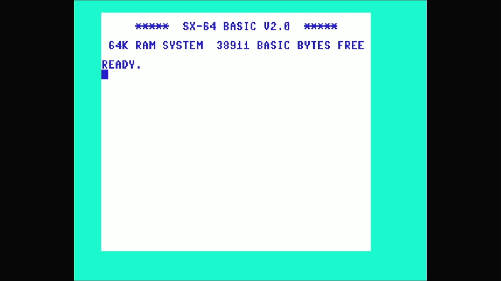

# DX-64 (NTSC)



- **`make kernel MACHINE=dx64`** — Commodore
- **Year**: 1984
- **Manufacturer**: Commodore Business Machines
- **Television**: NTSC

## At power-on

The DX-64 is the **twin-drive prototype** of the SX-64 — the same portable, luggable C64, but with a *second* built-in 5.25" 1541 fitted where the SX-64 has a keyboard-well storage slot. It runs the SX-64's own KERNAL, so it draws the same **distinct sign-on**: `***** SX-64 BASIC V2.0 *****`, `64K RAM SYSTEM  38911 BASIC BYTES FREE`, `READY.` — the SX kernal's inverted colour scheme, dark-blue text on a white screen (the breadbin's light-blue-on-dark-blue is reversed), which is the appliance's proof this is the SX romset and not a plain c64.

## Required assets

- `roms/dx64.zip`

  | ROM | CRC32 |
  |---|---|
  | `901226-01.ud4` | `f833d117` |
  | `251104-04.ud3` | `2c5965d4` |
  | `jiffydos sx64.ud3` | `2b5a88f5` |
  | `1541 flash.ud3` | `0a1c9b85` |
  | `turboromsx.u4` | `48579c30` |
  | `901225-01.ud1` | `ec4272ee` |
  | `906114-01.ue4` | `54c89351` |
- `roms/sx1541.zip`

## Notes

- MAME driver: `c64.cpp`.
- MAME clone of `c64` (Commodore 64 (NTSC)) — the system macro's parent field in the driver source. The ROM table above lists every member this machine's own zip needs.

## The two built-in drives

Where the SX-64's `ntsc_sx` config replaces the **iec8** slot's default with
the built-in `sx1541`, the DX-64's `ntsc_dx` config **builds on `ntsc_sx`**
and adds a *second* built-in drive on the **iec9** slot:

```
void sx64_state::ntsc_dx(machine_config &config)
{
    ntsc_sx(config);                                              // iec8 sx1541
    CBM_IEC_SLOT(config.replace(), "iec9", 9, sx1541_iec_devices, "sx1541");
}
```

So the DX-64 carries drives on **both** device 8 and device 9. Both are
**built-in hardware**, and built-in hardware is never removed: the appliance
ships the machine as the driver defines it, with no `-iec8`/`-iec9` override.
MAME's twin `sx1541` defaults stand, so the machine requires the `sx1541`
drive romset (one romset serves both drives) and boots to the SX kernal's own
sign-on **with both internal drives present**. (The C64-line `-iec8 ""` bake
applies only to machines whose device-8 default models an *external*, plug-in
drive — never to a built-in one.) On the real Pi 4, `dx64` boots cleanly with
both drives initialised and no missing-ROM fatal.

[← back to Commodore](README.md)
